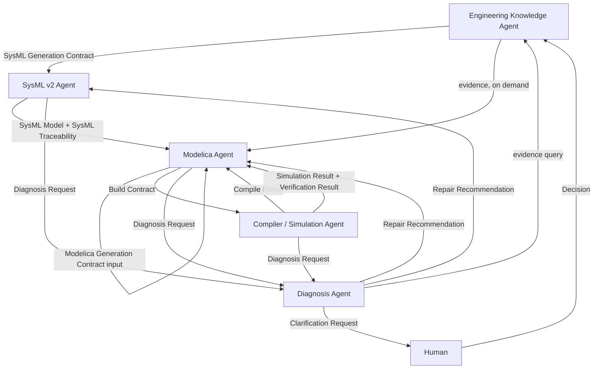

# Agent Contracts — Canonical Schema Reference

> Part of a four-agent pipeline. See also: [`Document Agent.md`](./Document%20Agent.md), [`SysML V2 Agent.md`](./SysML%20V2%20Agent.md), [`Modelica Agent.md`](./Modelica%20Agent.md), [`Compiler Agent.md`](./Compiler%20Agent.md), and the top-level [`README.md`](./README.md).

## 0. Why This Document Exists

Every other document in this repository sketches its contracts with a partial JSON example and a note like *"create a well-defined contract"* or *"define this schema before coding."* That is deliberate — each agent doc focuses on what it does with a contract, not on owning the contract's full definition. This document is where every contract that crosses an agent boundary gets its **one, complete, versioned definition**: every field, its type, whether it's required, and who produces/consumes it.

Rule: **nothing crosses an agent boundary as free-form text or an ad hoc dict.** If two agents exchange information, that information has a Pydantic model in this document, and both sides import it from a shared `contracts` package rather than re-declaring it locally.

```text
shared/
└── contracts/
    ├── __init__.py
    ├── common.py              # EvidenceRef, VersionRef, Severity, etc.
    ├── sysml_generation.py     # Section 2
    ├── sysml_plan.py           # Section 3
    ├── sysml_mapping.py        # Section 4
    ├── sysml_validation.py     # Section 5
    ├── sysml_traceability.py   # Section 6
    ├── sysml_manifest.py       # Section 7
    ├── modelica_generation.py  # Section 8
    ├── modelica_mapping.py     # Section 9
    ├── legacy_comparison.py    # Section 10
    ├── modelica_validation.py  # Section 11
    ├── modelica_traceability.py# Section 12
    ├── modelica_manifest.py    # Section 13
    ├── build_contract.py       # Section 14
    ├── compile_result.py       # Section 15
    ├── simulation_scenario.py  # Section 16
    ├── simulation_result.py    # Section 17
    ├── verification_result.py  # Section 18
    ├── execution_record.py     # Section 19
    ├── diagnosis.py            # Sections 20–21
    └── decisions.py            # Section 22
```

Every agent's own `schemas/` package (as laid out in each agent's folder structure) imports from `shared/contracts/` instead of redefining these types — the per-agent `schemas/` folders hold agent-internal types only (e.g. LangGraph `TypedDict` state), never the boundary contracts themselves.



Every model below uses [Pydantic v2](https://docs.pydantic.dev/) syntax. `EvidenceRef` and `VersionRef` (Section 1) are the two primitives that appear inside nearly every other contract — define them once, import everywhere.

---

## 1. Shared Primitives

**File:** `shared/contracts/common.py`

```python
from __future__ import annotations
from enum import Enum
from typing import Literal
from pydantic import BaseModel, Field


class SourceLocation(BaseModel):
    """Exactly one of these location fields is set, matching the source format."""
    page: int | None = None
    section: str | None = None
    sheet: str | None = None
    cell: str | None = None
    json_path: str | None = None
    file: str | None = None
    line: int | None = None
    bbox: tuple[float, float, float, float] | None = None


class EvidenceRef(BaseModel):
    evidence_id: str
    document_id: str
    location: SourceLocation
    quote: str | None = Field(default=None, max_length=500)


class VersionRef(BaseModel):
    """Pins every contract to the exact upstream state it was generated from."""
    knowledge_version: str
    sysml_version: str | None = None
    modelica_version: str | None = None
    execution_id: str | None = None


class FactStatus(str, Enum):
    EXPLICIT = "EXPLICIT"
    CONFIRMED = "CONFIRMED"
    INFERRED = "INFERRED"
    ASSUMED = "ASSUMED"
    PROPOSED = "PROPOSED"
    AMBIGUOUS = "AMBIGUOUS"
    CONFLICTED = "CONFLICTED"
    UNKNOWN = "UNKNOWN"
    USER_CONFIRMED = "USER_CONFIRMED"
    EXTERNAL_REFERENCE = "EXTERNAL_REFERENCE"


class Severity(str, Enum):
    ERROR = "ERROR"
    WARNING = "WARNING"
    INFO = "INFO"


class Comparator(str, Enum):
    LT = "<"
    LTE = "<="
    GT = ">"
    GTE = ">="
    EQ = "=="
    RANGE = "RANGE"
```

`SourceLocation` matches the provenance shapes already introduced in `Document Agent.md`, Section 41 (Evidence Model) — this is that same shape, promoted to a shared, reusable type instead of being redefined ad hoc by each downstream agent.

---

## 2. SysML Generation Contract

**Producer:** Engineering Knowledge Agent · **Consumer:** SysML v2 Agent
**File:** `shared/contracts/sysml_generation.py` · **Referenced from:** `SysML V2 Agent.md`, Section 2 and 5

```python
from pydantic import BaseModel
from .common import EvidenceRef, VersionRef, FactStatus, Comparator


class RequirementItem(BaseModel):
    id: str
    subject: str
    property: str
    operator: Comparator
    value: float | str | None = None
    min: float | None = None
    max: float | None = None
    unit: str | None = None
    status: FactStatus
    evidence: list[str]           # evidence_id references


class EntityItem(BaseModel):
    id: str
    name: str
    type: str
    status: FactStatus
    evidence: list[str]


class RelationshipItem(BaseModel):
    source: str                   # EntityItem.id
    target: str                   # EntityItem.id
    type: str                     # e.g. CONNECTED_TO, CONTROLS, SUPPLIES
    evidence: list[str]


class BehaviorItem(BaseModel):
    id: str
    trigger_property: str
    trigger_operator: Comparator
    trigger_value: float | str
    trigger_unit: str | None
    action_type: str
    action_target: str
    status: FactStatus
    evidence: list[str]


class ConstraintItem(BaseModel):
    id: str
    subject: str
    property: str
    min: float | None = None
    max: float | None = None
    unit: str | None = None
    evidence: list[str]


class InterfaceItem(BaseModel):
    id: str
    name: str
    kind: str                     # SIGNAL | FLUID | THERMAL | ELECTRICAL | MECHANICAL
    source_entity: str
    target_entity: str
    evidence: list[str]


class SysMLGenerationContract(BaseModel):
    project_id: str
    version: VersionRef

    requirements: list[RequirementItem] = []
    entities: list[EntityItem] = []
    relationships: list[RelationshipItem] = []
    behaviors: list[BehaviorItem] = []
    constraints: list[ConstraintItem] = []
    interfaces: list[InterfaceItem] = []

    evidence: list[EvidenceRef] = []   # full evidence records referenced by id above
```

```json
{
  "project_id": "iaq_001",
  "version": { "knowledge_version": "v0008" },
  "requirements": [
    {
      "id": "REQ-001", "subject": "Zone-01", "property": "CO2",
      "operator": "<=", "max": 1000, "unit": "ppm",
      "status": "CONFIRMED", "evidence": ["EV-101"]
    }
  ],
  "entities": [
    { "id": "ENT-001", "name": "AHU-01", "type": "AirHandlingUnit", "status": "EXPLICIT", "evidence": ["EV-050"] },
    { "id": "ENT-002", "name": "CO2Sensor-01", "type": "CO2Sensor", "status": "EXPLICIT", "evidence": ["EV-051"] }
  ],
  "relationships": [
    { "source": "ENT-001", "target": "ENT-002", "type": "CONNECTED_TO", "evidence": ["EV-052"] }
  ],
  "behaviors": [],
  "constraints": [],
  "interfaces": [],
  "evidence": [
    { "evidence_id": "EV-101", "document_id": "doc_001", "location": { "page": 8 }, "quote": "Zone temperature/CO2 shall remain..." }
  ]
}
```

This is the same shape sketched informally in `SysML V2 Agent.md`, Section 2 — now with every field typed, `status` and `evidence` mandatory on every item, and a proper `VersionRef` instead of a bare version string.

---

## 3. SysML Generation Plan

**Producer/Consumer:** internal to the SysML v2 Agent (Model Planner stage → mapping stages)
**File:** `shared/contracts/sysml_plan.py` · **Referenced from:** `SysML V2 Agent.md`, Section 6

```python
from pydantic import BaseModel


class OpenQuestion(BaseModel):
    question_id: str
    question: str
    candidates: list[str]
    blocks: list[str]             # ids of plan items that cannot proceed until answered


class SysMLGenerationPlan(BaseModel):
    project_id: str
    generation_id: str

    packages: list[str]
    parts: list[str]
    requirements: list[str]       # RequirementItem.id references
    interfaces: list[str]
    behaviors: list[str]

    open_questions: list[OpenQuestion] = []
```

```json
{
  "project_id": "iaq_001",
  "generation_id": "gen_00007",
  "packages": ["IAQSystem", "Requirements", "Architecture", "Behaviors", "Interfaces"],
  "parts": ["IAQSystem", "AHU", "CO2Sensor", "Controller", "Damper"],
  "requirements": ["REQ-001", "REQ-002"],
  "interfaces": ["CO2Signal", "ControlSignal"],
  "behaviors": ["CO2Control"],
  "open_questions": []
}
```

A non-empty `open_questions` list is exactly what routes the workflow to HITL-1/HITL-2 in `SysML V2 Agent.md`, Section 20, instead of silently guessing.

---

## 4. SysML Element Mapping

**Producer/Consumer:** internal to the SysML v2 Agent (mapping stages → generator)
**File:** `shared/contracts/sysml_mapping.py` · **Referenced from:** `SysML V2 Agent.md`, Section 7–13

```python
from enum import Enum
from pydantic import BaseModel


class SysMLConstruct(str, Enum):
    PART_DEF = "part def"
    PART = "part"
    REQUIREMENT_DEF = "requirement def"
    REQUIREMENT = "requirement"
    INTERFACE_DEF = "interface def"
    PORT_DEF = "port def"
    ACTION_DEF = "action def"
    STATE_DEF = "state def"
    CONSTRAINT_DEF = "constraint def"
    ATTRIBUTE = "attribute"
    CONNECTION = "connection"


class SysMLElementMapping(BaseModel):
    engineering_id: str            # e.g. ENT-001, REQ-001, BEH-001
    engineering_type: str          # entity | requirement | behavior | constraint | interface
    sysml_construct: SysMLConstruct
    sysml_element_name: str
    package: str
    rationale: str
    evidence: list[str]
```

```json
{
  "engineering_id": "REQ-001",
  "engineering_type": "requirement",
  "sysml_construct": "requirement def",
  "sysml_element_name": "CO2Requirement",
  "package": "Requirements",
  "rationale": "Explicit numeric bound on a monitored property maps directly to a requirement definition.",
  "evidence": ["EV-101"]
}
```

---

## 5. SysML Validation Result

**Producer:** SysML v2 Agent (validation stage) · **Consumer:** SysML Agent's own repair loop, Diagnosis Agent
**File:** `shared/contracts/sysml_validation.py` · **Referenced from:** `SysML V2 Agent.md`, Section 17–18

```python
from enum import Enum
from pydantic import BaseModel
from .common import Severity


class ValidationStatus(str, Enum):
    PASSED = "PASSED"
    FAILED = "FAILED"


class SyntaxError_(BaseModel):
    file: str
    line: int
    message: str


class StructuralError(BaseModel):
    element: str
    error: str


class RequirementCoverage(BaseModel):
    total: int
    implemented: int
    missing: list[str]            # RequirementItem.id list


class TraceabilityError(BaseModel):
    element: str
    error: str


class SemanticError(BaseModel):
    element: str
    expected: str
    actual: str


class SysMLValidationResult(BaseModel):
    generation_id: str
    status: ValidationStatus

    syntax_errors: list[SyntaxError_] = []
    structural_errors: list[StructuralError] = []
    requirement_coverage: RequirementCoverage
    traceability_errors: list[TraceabilityError] = []
    semantic_errors: list[SemanticError] = []
```

```json
{
  "generation_id": "gen_00007",
  "status": "FAILED",
  "syntax_errors": [],
  "structural_errors": [
    { "element": "Controller", "error": "Referenced port does not exist" }
  ],
  "requirement_coverage": { "total": 12, "implemented": 11, "missing": ["REQ-009"] },
  "traceability_errors": [],
  "semantic_errors": []
}
```

---

## 6. SysML Traceability Record

**Producer:** SysML v2 Agent · **Consumer:** Modelica Agent, Diagnosis Agent
**File:** `shared/contracts/sysml_traceability.py` · **Referenced from:** `SysML V2 Agent.md`, Section 16

```python
from pydantic import BaseModel


class SysMLTraceEntry(BaseModel):
    engineering_id: str            # REQ-001, ENT-001, BEH-001, ...
    sysml_element: str
    file: str
    evidence: list[str]


class SysMLTraceability(BaseModel):
    sysml_version: str
    entries: list[SysMLTraceEntry]
```

```json
{
  "sysml_version": "v0004",
  "entries": [
    { "engineering_id": "REQ-001", "sysml_element": "CO2Requirement", "file": "Requirements.sysml", "evidence": ["EV-101"] },
    { "engineering_id": "ENT-001", "sysml_element": "AHU", "file": "Architecture.sysml", "evidence": ["EV-050"] },
    { "engineering_id": "BEH-001", "sysml_element": "CO2Control", "file": "Behaviors.sysml", "evidence": ["EV-090"] }
  ]
}
```

---

## 7. SysML Manifest

**Producer:** SysML v2 Agent · **Consumer:** Modelica Agent, versioning/reporting tools
**File:** `shared/contracts/sysml_manifest.py` · **Referenced from:** `SysML V2 Agent.md`, Section 15

```python
from pydantic import BaseModel


class SysMLManifest(BaseModel):
    sysml_version: str
    knowledge_version: str
    files: list[str]
    requirement_map: dict[str, str]   # REQ-id -> sysml_element name
    entity_map: dict[str, str]        # ENT-id -> sysml_element name
```

```json
{
  "sysml_version": "v0004",
  "knowledge_version": "v0008",
  "files": ["Architecture.sysml", "Requirements.sysml", "Behaviors.sysml"],
  "requirement_map": { "REQ-001": "CO2Requirement" },
  "entity_map": { "ENT-001": "AHU" }
}
```

---

## 8. Modelica Generation Contract

**Producer:** SysML v2 Agent + Engineering Knowledge Agent · **Consumer:** Modelica Agent
**File:** `shared/contracts/modelica_generation.py` · **Referenced from:** `Modelica Agent.md`, Section 7

```python
from pydantic import BaseModel
from .common import VersionRef


class ModelicaGenerationContract(BaseModel):
    project_id: str
    version: VersionRef            # sysml_version + knowledge_version required here

    components: list[str] = []     # SysMLElementMapping.engineering_id list, part-typed
    properties: list[str] = []
    interfaces: list[str] = []
    behaviors: list[str] = []
    constraints: list[str] = []

    legacy_models: list[str] = []  # filenames under source/original/, e.g. 07_legacy_co2_control.mo
```

```json
{
  "project_id": "iaq_001",
  "version": { "knowledge_version": "v0008", "sysml_version": "v0004" },
  "components": ["ENT-001", "ENT-002", "ENT-003", "ENT-004"],
  "properties": ["REQ-001"],
  "interfaces": ["CO2Signal", "ControlSignal"],
  "behaviors": ["BEH-001"],
  "constraints": [],
  "legacy_models": ["07_legacy_co2_control.mo"]
}
```

---

## 9. Modelica Mapping Record

**Producer/Consumer:** internal to the Modelica Agent (mapping stages → generator)
**File:** `shared/contracts/modelica_mapping.py` · **Referenced from:** `Modelica Agent.md`, Sections 8–13

```python
from enum import Enum
from pydantic import BaseModel


class ModelicaMappingType(str, Enum):
    MODEL = "MODEL"
    BLOCK = "BLOCK"
    CONNECTOR = "CONNECTOR"
    PARAMETER = "PARAMETER"
    EQUATION = "EQUATION"
    ALGORITHM = "ALGORITHM"
    ASSERTION = "ASSERTION"
    LIBRARY_COMPONENT = "LIBRARY_COMPONENT"


class ModelicaMapping(BaseModel):
    sysml_element: str
    mapping_type: ModelicaMappingType
    target: str                    # e.g. "Modelica.Blocks.Interfaces.RealInput" or a local class name
    reason: str
    evidence: list[str]
```

```json
{
  "sysml_element": "CO2Sensor",
  "mapping_type": "LIBRARY_COMPONENT",
  "target": "Modelica.Blocks.Interfaces.RealInput",
  "reason": "Sensor output represented as scalar signal",
  "evidence": ["EV-120"]
}
```

---

## 10. Legacy Comparison Record

**Producer/Consumer:** internal to the Modelica Agent (legacy reuse analysis → mapping/generation)
**File:** `shared/contracts/legacy_comparison.py` · **Referenced from:** `Modelica Agent.md`, Section 15

```python
from enum import Enum
from pydantic import BaseModel


class LegacyRecommendation(str, Enum):
    REUSE_AS_IS = "REUSE_AS_IS"
    MODIFY_LEGACY = "MODIFY_LEGACY"
    REPLACE = "REPLACE"


class LegacyComparison(BaseModel):
    sysml_element: str
    legacy_class: str
    legacy_file: str
    matches: list[str]
    differences: list[str]
    recommendation: LegacyRecommendation
    evidence: list[str] = []
```

```json
{
  "sysml_element": "CO2Controller",
  "legacy_class": "LegacyCO2Controller",
  "legacy_file": "07_legacy_co2_control.mo",
  "matches": ["CO2 input", "ventilation output"],
  "differences": ["SysML requires 900 ppm", "legacy model uses 1000 ppm"],
  "recommendation": "MODIFY_LEGACY",
  "evidence": ["EV-101"]
}
```

---

## 11. Modelica Validation Result

**Producer:** Modelica Agent (validation stage) · **Consumer:** Modelica Agent's own repair loop, Diagnosis Agent
**File:** `shared/contracts/modelica_validation.py` · **Referenced from:** `Modelica Agent.md`, Section 22

```python
from enum import Enum
from pydantic import BaseModel


class ValidationLayer(str, Enum):
    SYNTAX = "SYNTAX"
    STRUCTURAL = "STRUCTURAL"
    CONNECTION = "CONNECTION"
    UNIT = "UNIT"
    PARAMETER = "PARAMETER"
    SEMANTIC = "SEMANTIC"


class ModelicaValidationIssue(BaseModel):
    layer: ValidationLayer
    element: str
    message: str


class ModelicaValidationResult(BaseModel):
    modelica_version: str
    status: str                    # PASSED | FAILED
    issues: list[ModelicaValidationIssue] = []
```

```json
{
  "modelica_version": "v0003",
  "status": "FAILED",
  "issues": [
    { "layer": "CONNECTION", "element": "Controller.CO2", "message": "Connector type mismatch: RealOutput vs RealInput expected Boolean" }
  ]
}
```

This is the pre-compile, static-analysis result — distinct from the `CompileResult` in Section 15, which comes from the actual compiler defined in `Compiler Agent.md`.

---

## 12. Modelica Traceability Record

**Producer:** Modelica Agent · **Consumer:** Compiler Agent, Diagnosis Agent
**File:** `shared/contracts/modelica_traceability.py` · **Referenced from:** `Modelica Agent.md`, Section 21

```python
from pydantic import BaseModel


class ModelicaTraceEntity(BaseModel):
    engineering_id: str
    sysml_element: str
    modelica_class: str
    file: str


class ModelicaTraceRequirement(BaseModel):
    requirement_id: str
    sysml_requirement: str
    modelica_elements: list[str]   # e.g. "Controller.CO2Limit"
    evidence: list[str]


class ModelicaTraceability(BaseModel):
    modelica_version: str
    sysml_version: str
    knowledge_version: str
    entities: list[ModelicaTraceEntity]
    requirements: list[ModelicaTraceRequirement]
```

```json
{
  "modelica_version": "v0003",
  "sysml_version": "v0004",
  "knowledge_version": "v0008",
  "entities": [
    { "engineering_id": "ENT-001", "sysml_element": "AHU", "modelica_class": "AHU", "file": "AHU.mo" }
  ],
  "requirements": [
    { "requirement_id": "REQ-001", "sysml_requirement": "CO2Requirement", "modelica_elements": ["Controller.CO2Limit"], "evidence": ["EV-101"] }
  ]
}
```

---

## 13. Modelica Manifest

**Producer:** Modelica Agent · **Consumer:** Compiler Agent (build contract construction), versioning/reporting tools
**File:** `shared/contracts/modelica_manifest.py` · **Referenced from:** `Modelica Agent.md`, Section 20

```python
from pydantic import BaseModel


class ModelicaManifest(BaseModel):
    modelica_version: str
    sysml_version: str
    knowledge_version: str
    entry_class: str
    classes: list[str]
    files: list[str]
```

```json
{
  "modelica_version": "v0003",
  "sysml_version": "v0004",
  "knowledge_version": "v0008",
  "entry_class": "IAQSystem",
  "classes": ["IAQSystem", "AHU", "CO2Sensor", "Controller", "Damper"],
  "files": ["package.mo", "IAQSystem.mo", "AHU.mo", "CO2Sensor.mo", "Controller.mo", "Damper.mo"]
}
```

---

## 14. Build Contract

**Producer:** Modelica Agent · **Consumer:** Compiler / Simulation Agent
**File:** `shared/contracts/build_contract.py` · **Referenced from:** `Compiler Agent.md`, Section 6

```python
from pydantic import BaseModel


class ResourceLimits(BaseModel):
    max_build_seconds: int = 120
    max_simulate_seconds: int = 300
    max_memory_mb: int = 2048


class BuildContract(BaseModel):
    project_id: str
    modelica_version: str
    execution_id: str

    entry_class: str
    package_root: str
    files: list[str]

    backend: str = "openmodelica"
    backend_version_hint: str | None = None

    simulate: bool = True
    scenario_source: str = "requirements"   # requirements | commissioning | explicit | hitl

    requirements_to_verify: list[str] = []
    resource_limits: ResourceLimits = ResourceLimits()
```

```json
{
  "project_id": "iaq_001",
  "modelica_version": "v0003",
  "execution_id": "exec_00042",
  "entry_class": "IAQSystem",
  "package_root": "modelica/generated/",
  "files": ["package.mo", "IAQSystem.mo", "AHU.mo", "CO2Sensor.mo", "Controller.mo", "Damper.mo"],
  "backend": "openmodelica",
  "backend_version_hint": ">=1.22",
  "simulate": true,
  "scenario_source": "requirements",
  "requirements_to_verify": ["REQ-001"],
  "resource_limits": { "max_build_seconds": 120, "max_simulate_seconds": 300, "max_memory_mb": 2048 }
}
```

---

## 15. Compile Result

**Producer:** Compiler / Simulation Agent · **Consumer:** Modelica Agent, Diagnosis Agent
**File:** `shared/contracts/compile_result.py` · **Referenced from:** `Compiler Agent.md`, Section 9

```python
from enum import Enum
from pydantic import BaseModel


class CompileStatus(str, Enum):
    PREFLIGHT_FAILED = "PREFLIGHT_FAILED"
    PASSED = "PASSED"
    FAILED = "FAILED"


class ErrorCategory(str, Enum):
    SYNTAX_ERROR = "SYNTAX_ERROR"
    CLASS_NOT_FOUND = "CLASS_NOT_FOUND"
    CONNECTOR_TYPE_MISMATCH = "CONNECTOR_TYPE_MISMATCH"
    CONNECTOR_UNCONNECTED = "CONNECTOR_UNCONNECTED"
    DUPLICATE_DECLARATION = "DUPLICATE_DECLARATION"
    MISSING_PARAMETER = "MISSING_PARAMETER"
    DIMENSION_MISMATCH = "DIMENSION_MISMATCH"
    UNIT_MISMATCH = "UNIT_MISMATCH"
    OVERDETERMINED_SYSTEM = "OVERDETERMINED_SYSTEM"
    UNDERDETERMINED_SYSTEM = "UNDERDETERMINED_SYSTEM"
    UNKNOWN = "UNKNOWN"


class CompileError(BaseModel):
    error_id: str
    severity: str
    category: ErrorCategory
    file: str
    line: int
    message: str
    raw: str


class CompileWarning(BaseModel):
    warning_id: str
    category: str
    file: str
    line: int
    message: str


class CompileResult(BaseModel):
    execution_id: str
    status: CompileStatus
    backend: str
    backend_version: str
    duration_seconds: float
    errors: list[CompileError] = []
    warnings: list[CompileWarning] = []
```

```json
{
  "execution_id": "exec_00042",
  "status": "FAILED",
  "backend": "openmodelica",
  "backend_version": "1.23.0",
  "duration_seconds": 4.2,
  "errors": [
    {
      "error_id": "ERR-001", "severity": "ERROR", "category": "CONNECTOR_TYPE_MISMATCH",
      "file": "Controller.mo", "line": 42,
      "message": "Connector type mismatch: RealOutput vs RealInput expected Boolean",
      "raw": "[Controller.mo:42:5-42:41] Error: ..."
    }
  ],
  "warnings": []
}
```

---

## 16. Simulation Scenario

**Producer:** Compiler / Simulation Agent (derived, per `Compiler Agent.md` Section 10) · **Consumer:** Compiler / Simulation Agent's own simulation runner
**File:** `shared/contracts/simulation_scenario.py` · **Referenced from:** `Compiler Agent.md`, Section 10

```python
from pydantic import BaseModel


class ScenarioOrigin(BaseModel):
    type: str                      # REQUIREMENT | COMMISSIONING | EXPLICIT | HITL
    requirement_id: str | None = None
    evidence: list[str] = []


class SimulationScenario(BaseModel):
    execution_id: str
    start_time: float
    stop_time: float
    interval: float
    tolerance: float
    solver: str
    output_variables: list[str]
    derived_from: ScenarioOrigin
```

```json
{
  "execution_id": "exec_00042",
  "start_time": 0,
  "stop_time": 3600,
  "interval": 1,
  "tolerance": 1e-6,
  "solver": "dassl",
  "output_variables": ["controller.CO2", "controller.ventilationCommand", "damper.position"],
  "derived_from": { "type": "REQUIREMENT", "requirement_id": "REQ-001", "evidence": ["EV-101"] }
}
```

---

## 17. Simulation Result

**Producer:** Compiler / Simulation Agent · **Consumer:** Modelica Agent, Diagnosis Agent
**File:** `shared/contracts/simulation_result.py` · **Referenced from:** `Compiler Agent.md`, Section 12

```python
from pydantic import BaseModel


class VariableStat(BaseModel):
    name: str
    unit: str
    min: float
    max: float
    final: float


class SolverDiagnostics(BaseModel):
    converged: bool
    warnings: list[str] = []


class SimulationResult(BaseModel):
    execution_id: str
    status: str                    # COMPLETED | SOLVER_FAILURE
    duration_seconds: float
    result_file: str
    result_csv: str
    variables: list[VariableStat]
    solver_diagnostics: SolverDiagnostics
```

```json
{
  "execution_id": "exec_00042",
  "status": "COMPLETED",
  "duration_seconds": 11.8,
  "result_file": "compiler/simulation/result.mat",
  "result_csv": "compiler/simulation/result.csv",
  "variables": [
    { "name": "controller.CO2", "unit": "ppm", "min": 410.2, "max": 1123.7, "final": 980.1 }
  ],
  "solver_diagnostics": { "converged": true, "warnings": [] }
}
```

---

## 18. Verification Result

**Producer:** Compiler / Simulation Agent (deterministic verifier) · **Consumer:** Modelica Agent, Diagnosis Agent
**File:** `shared/contracts/verification_result.py` · **Referenced from:** `Compiler Agent.md`, Section 13

```python
from enum import Enum
from pydantic import BaseModel


class VerificationOutcome(str, Enum):
    PASSED = "PASSED"
    VIOLATED = "VIOLATED"
    INCONCLUSIVE = "INCONCLUSIVE"
    NOT_TESTABLE = "NOT_TESTABLE"


class RequirementVerification(BaseModel):
    requirement_id: str
    subject: str
    property: str
    constraint: dict                # {"max": 1000, "unit": "ppm"} etc., mirrors RequirementItem bounds
    observed: dict                  # {"max": 1123.7, "unit": "ppm"}
    result: VerificationOutcome
    evidence: list[str]
    simulation_variable: str | None


class VerificationResult(BaseModel):
    execution_id: str
    verifications: list[RequirementVerification]
    overall_status: str             # PASSED | FAILED
```

```json
{
  "execution_id": "exec_00042",
  "verifications": [
    {
      "requirement_id": "REQ-001", "subject": "Zone-01", "property": "CO2",
      "constraint": { "max": 1000, "unit": "ppm" },
      "observed": { "max": 1123.7, "unit": "ppm" },
      "result": "VIOLATED",
      "evidence": ["EV-101"],
      "simulation_variable": "controller.CO2"
    }
  ],
  "overall_status": "FAILED"
}
```

---

## 19. Execution Record

**Producer:** Compiler / Simulation Agent (versioning) · **Consumer:** all agents querying execution history
**File:** `shared/contracts/execution_record.py` · **Referenced from:** `Compiler Agent.md`, Section 19

```python
from pydantic import BaseModel


class ExecutionRecord(BaseModel):
    execution_id: str
    modelica_version: str
    created_at: str
    compile_status: str
    simulation_status: str
    verification_status: str
    parent_execution: str | None
```

```json
{
  "execution_id": "exec_00042",
  "modelica_version": "v0003",
  "created_at": "2026-09-18T09:00:00Z",
  "compile_status": "PASSED",
  "simulation_status": "COMPLETED",
  "verification_status": "FAILED",
  "parent_execution": "exec_00041"
}
```

---

## 20. Diagnosis Request

**Producer:** Modelica Agent, SysML Agent, or Compiler Agent (whichever hit the failure) · **Consumer:** Diagnosis Agent

The Diagnosis Agent is referenced throughout every other document as the coordinator of the repair loop, but none of them formalize what actually gets handed to it. This is that contract.

**File:** `shared/contracts/diagnosis.py`

```python
from enum import Enum
from pydantic import BaseModel
from .common import VersionRef


class DiagnosisTrigger(str, Enum):
    SYSML_VALIDATION_FAILURE = "SYSML_VALIDATION_FAILURE"
    MODELICA_VALIDATION_FAILURE = "MODELICA_VALIDATION_FAILURE"
    COMPILE_FAILURE = "COMPILE_FAILURE"
    VERIFICATION_FAILURE = "VERIFICATION_FAILURE"
    SOLVER_FAILURE = "SOLVER_FAILURE"


class DiagnosisRequest(BaseModel):
    diagnosis_id: str
    project_id: str
    version: VersionRef
    trigger: DiagnosisTrigger
    reporting_agent: str            # "sysml_agent" | "modelica_agent" | "compiler_agent"

    # exactly one of these is populated, matching `trigger`
    sysml_validation_result: dict | None = None      # SysMLValidationResult
    modelica_validation_result: dict | None = None   # ModelicaValidationResult
    compile_result: dict | None = None                # CompileResult
    verification_result: dict | None = None            # VerificationResult

    repair_attempt: int = 0
```

```json
{
  "diagnosis_id": "diag_00019",
  "project_id": "iaq_001",
  "version": { "knowledge_version": "v0008", "sysml_version": "v0004", "modelica_version": "v0003", "execution_id": "exec_00042" },
  "trigger": "VERIFICATION_FAILURE",
  "reporting_agent": "modelica_agent",
  "verification_result": {
    "execution_id": "exec_00042",
    "verifications": [
      { "requirement_id": "REQ-001", "result": "VIOLATED" }
    ],
    "overall_status": "FAILED"
  },
  "repair_attempt": 1
}
```

---

## 21. Repair Recommendation

**Producer:** Diagnosis Agent · **Consumer:** Modelica Agent or SysML Agent (per `target_agent`)
**File:** `shared/contracts/diagnosis.py` (same module as Section 20)

```python
from enum import Enum
from pydantic import BaseModel


class RepairActionType(str, Enum):
    MODIFY_MODELICA = "MODIFY_MODELICA"
    MODIFY_SYSML = "MODIFY_SYSML"
    REQUEST_KNOWLEDGE = "REQUEST_KNOWLEDGE"
    ESCALATE_HUMAN = "ESCALATE_HUMAN"


class RepairRecommendation(BaseModel):
    diagnosis_id: str
    root_cause_hypothesis: str
    confidence: float               # 0.0-1.0
    action_type: RepairActionType
    target_agent: str
    instructions: str
    supporting_evidence: list[str]  # evidence_id references gathered during diagnosis
```

```json
{
  "diagnosis_id": "diag_00019",
  "root_cause_hypothesis": "CO2Limit parameter (1000 ppm) reflects the superseded legacy value, not the current approved requirement (900 ppm).",
  "confidence": 0.86,
  "action_type": "MODIFY_MODELICA",
  "target_agent": "modelica_agent",
  "instructions": "Update Controller.CO2Limit from 1000 to 900 ppm per REQ-001 (evidence EV-101) and recompile.",
  "supporting_evidence": ["EV-101", "EV-205"]
}
```

`confidence` below an agent-configured threshold (e.g. `< 0.6`) should route to `ESCALATE_HUMAN` rather than being applied automatically — this is the deterministic gate between an automatic repair attempt and HITL-5 in `SysML V2 Agent.md` / HITL-5 in `Modelica Agent.md`.

---

## 22. Clarification Request and Decision

**Producer:** any agent (via the Engineering Knowledge Agent's HITL workflow) · **Consumer:** human reviewer, then back into the Engineering Knowledge Agent's decision ledger

This formalizes the decision ledger already introduced informally in `Document Agent.md`, Sections 37–39.

**File:** `shared/contracts/decisions.py`

```python
from enum import Enum
from pydantic import BaseModel


class ImpactLevel(str, Enum):
    LOW = "LOW"
    MEDIUM = "MEDIUM"
    HIGH = "HIGH"


class ClarificationRequest(BaseModel):
    question_id: str
    requested_by_agent: str
    question: str
    candidates: list[str]
    impact: ImpactLevel
    affects: list[str]              # ids of entities/requirements/mappings blocked on this


class Decision(BaseModel):
    decision_id: str
    question_id: str
    question: str
    answer: str
    source: str = "USER"
    timestamp: str
    affects: list[str]
```

```json
{
  "decision_id": "DEC-001",
  "question_id": "Q-014",
  "question": "\"Heating system\" is referenced for AHU-01. Should this be interpreted as heating coil, hot-water loop, or heating plant?",
  "answer": "Heating coil",
  "source": "USER",
  "timestamp": "2026-09-18T09:12:00Z",
  "affects": ["rel_103"]
}
```

---

## 23. Contract Compatibility Rule

Every contract above carries the version fields it needs to identify exactly which upstream state produced it (`VersionRef`, or the narrower `*_version` fields on records that only need one axis). Two rules follow directly from that:

1. **A consumer must reject a contract whose version fields don't match its own expectation.** E.g. the Compiler Agent must refuse a `BuildContract` referencing a `modelica_version` that its `Modelica Agent` client hasn't actually published yet.
2. **A contract is never mutated in place.** A new `modelica_version`, `sysml_version`, or `execution_id` always produces a new contract instance; old instances remain readable for traceability, exactly as each agent document's own versioning section already requires.

---

## 24. Cross-Reference Index

| Contract | Section | Producer → Consumer |
|---|---|---|
| SysML Generation Contract | 2 | Knowledge Agent → SysML Agent |
| SysML Generation Plan | 3 | internal to SysML Agent |
| SysML Element Mapping | 4 | internal to SysML Agent |
| SysML Validation Result | 5 | SysML Agent → self (repair) / Diagnosis Agent |
| SysML Traceability Record | 6 | SysML Agent → Modelica Agent / Diagnosis Agent |
| SysML Manifest | 7 | SysML Agent → Modelica Agent |
| Modelica Generation Contract | 8 | SysML Agent + Knowledge Agent → Modelica Agent |
| Modelica Mapping Record | 9 | internal to Modelica Agent |
| Legacy Comparison Record | 10 | internal to Modelica Agent |
| Modelica Validation Result | 11 | Modelica Agent → self (repair) / Diagnosis Agent |
| Modelica Traceability Record | 12 | Modelica Agent → Compiler Agent / Diagnosis Agent |
| Modelica Manifest | 13 | Modelica Agent → Compiler Agent |
| Build Contract | 14 | Modelica Agent → Compiler Agent |
| Compile Result | 15 | Compiler Agent → Modelica Agent / Diagnosis Agent |
| Simulation Scenario | 16 | internal to Compiler Agent |
| Simulation Result | 17 | Compiler Agent → Modelica Agent / Diagnosis Agent |
| Verification Result | 18 | Compiler Agent → Modelica Agent / Diagnosis Agent |
| Execution Record | 19 | Compiler Agent → all (history queries) |
| Diagnosis Request | 20 | SysML/Modelica/Compiler Agent → Diagnosis Agent |
| Repair Recommendation | 21 | Diagnosis Agent → SysML/Modelica Agent |
| Clarification Request / Decision | 22 | any agent ↔ human, via Knowledge Agent |
