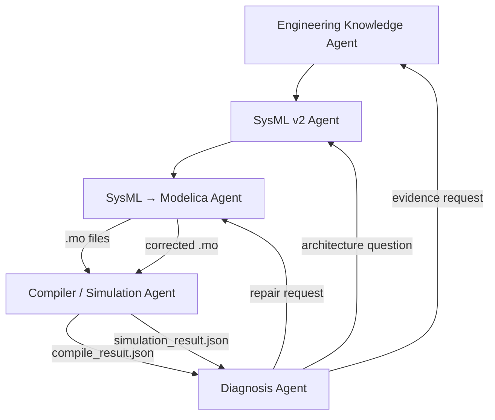
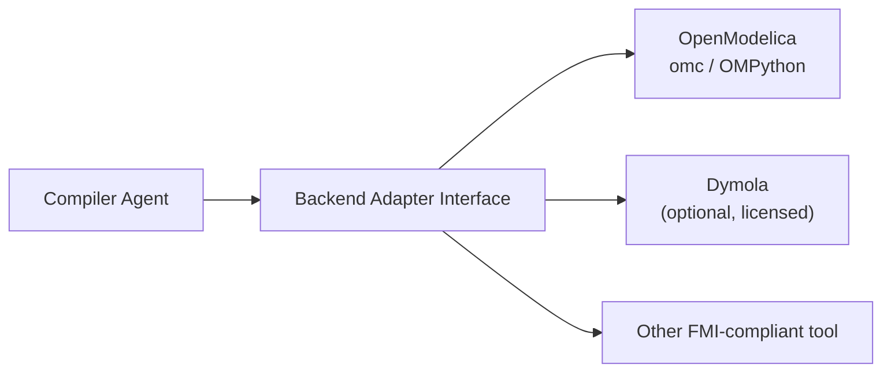
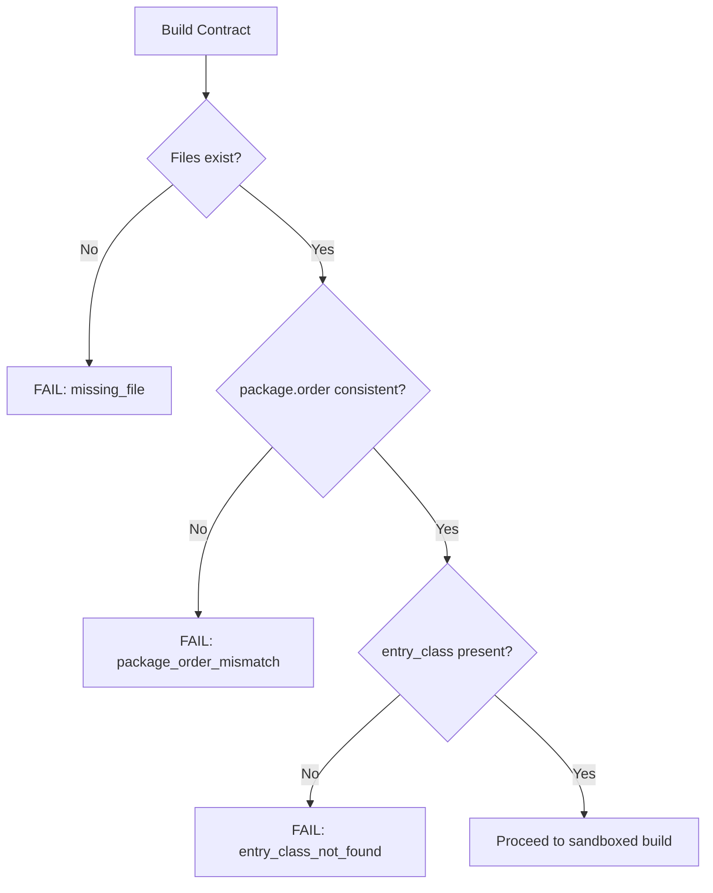
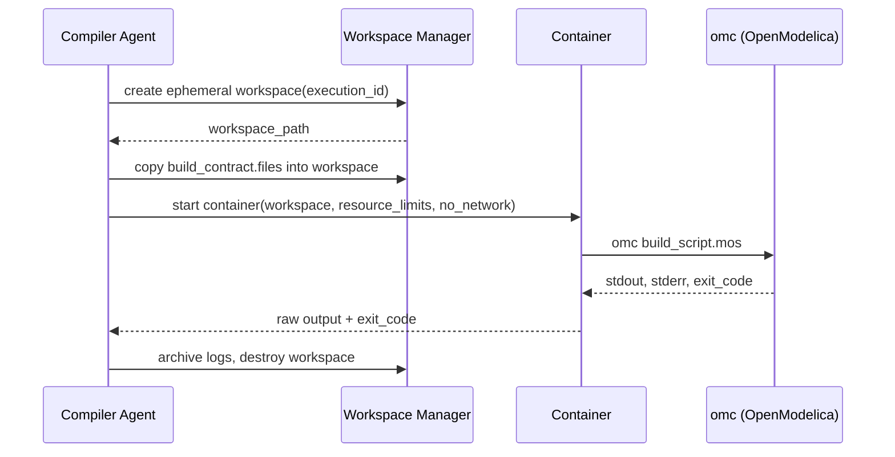
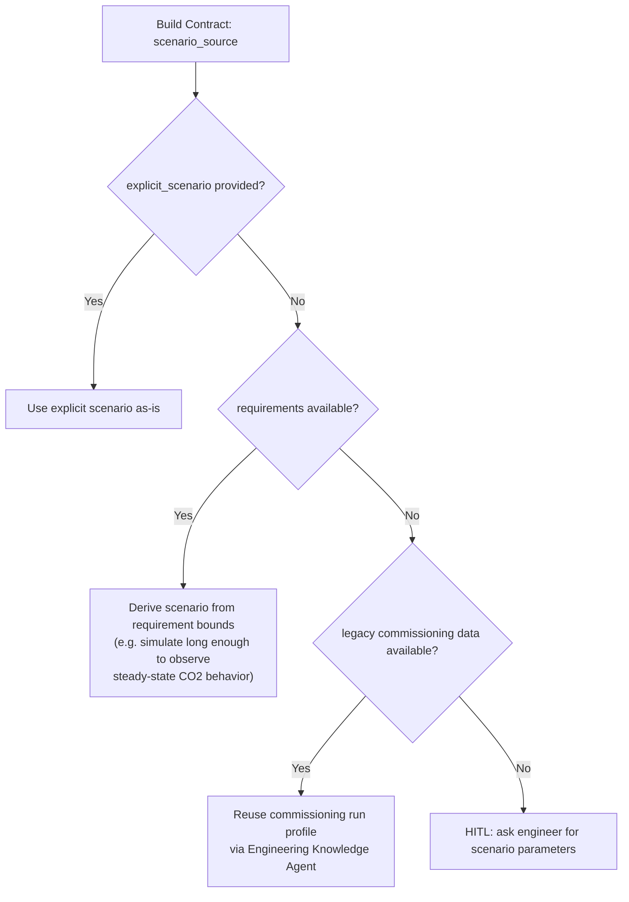
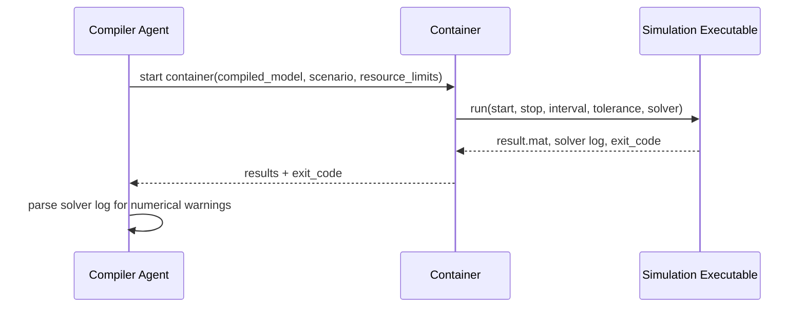
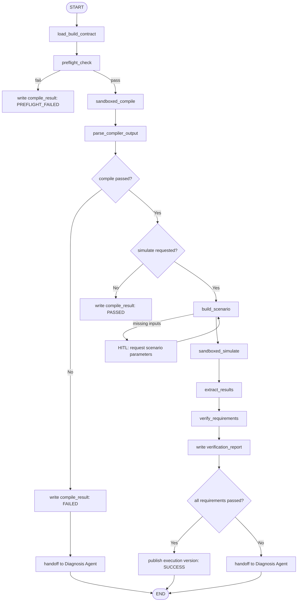
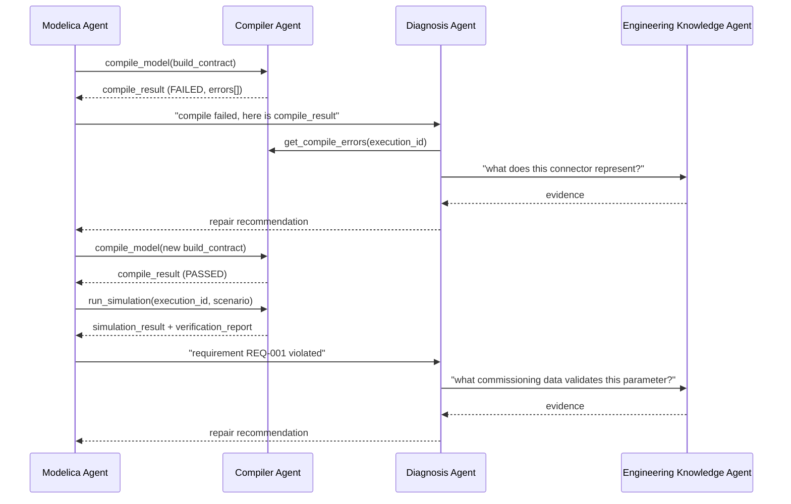

# Compiler / Simulation Agent — Detailed Implementation Plan

> Part of a four-agent pipeline. See also: [`Document Agent.md`](./Document%20Agent.md) (Engineering Knowledge Agent), [`SysML V2 Agent.md`](./SysML%20V2%20Agent.md), [`Modelica Agent.md`](./Modelica%20Agent.md) (SysML → Modelica Agent), [`Agent Contracts.md`](./Agent%20Contracts.md) (the typed schema for every payload exchanged between these agents), and the top-level [`README.md`](./README.md) for the unified architecture.

## 1. Purpose and Position in the Pipeline

The Compiler / Simulation Agent is the **execution boundary** of the pipeline. Every agent before it (Document, SysML, Modelica) reasons in text and structured knowledge. This agent is the first point where an artifact is actually **run** by a deterministic external tool (a Modelica compiler and a simulation solver) instead of being interpreted by an LLM.



Core principle:

> The Compiler / Simulation Agent never decides *why* something failed and never edits Modelica code. It only builds, runs, and reports facts. Interpretation belongs to the Diagnosis Agent; repair belongs to the Modelica Agent.

This separation mirrors the rule already established for the Document Agent: the LLM reasons over evidence, it does not become the evidence. Here: **agents reason over execution results; the compiler/solver remains the single source of truth for whether code compiles and how the system behaves numerically.**

---

## 2. Scope of the Compiler / Simulation Agent

The agent has three modes.

### 2.1 Build mode

Given `.mo` files and a package manifest, produce a deterministic compilation result: success/failure, structured errors, structured warnings.

### 2.2 Simulation mode

Given a compiled model and a simulation scenario (derived from requirements, commissioning data, or an explicit request), run the solver and produce structured numerical results.

### 2.3 Verification mode

Given simulation results and the requirement set from the Engineering Knowledge Agent, deterministically check whether requirements are satisfied (e.g. "CO2 stayed below 1000 ppm for the full run"). This is **not** an LLM judgment — it is a numeric comparison against thresholds carried in the traceability chain.

What this agent explicitly does **not** do:

```text
does NOT diagnose root cause
does NOT modify Modelica source
does NOT decide requirement precedence
does NOT query engineering documents directly
does NOT retry indefinitely
```

---

## 3. Recommended Technology Stack

### 3.1 Language

Python 3.11+, matching the rest of the pipeline, so the LangGraph state and tool contracts stay uniform.

### 3.2 Compiler / solver backends

The agent must not hard-code a single vendor. Use an adapter layer:



Recommended default backend: **OpenModelica** (`omc` CLI / OMPython), because it is scriptable, free, and container-friendly. Other backends implement the same adapter interface and can be selected per project without changing the rest of the agent.

### 3.3 Execution isolation

```text
Docker / OCI container
+
per-run ephemeral workspace
+
CPU / memory / wall-clock limits
+
no network access
+
non-root user
```

This directly satisfies the security rule already stated in the Document Agent spec ("never execute untrusted code outside an isolated container"). The Modelica source being compiled here is LLM-generated or LLM-modified, so it must always be treated as untrusted.

### 3.4 Orchestration

Same as the other agents:

```text
LangGraph   → durable workflow, retries, interrupts
Deep Agents → not required here; this agent is mostly deterministic
OpenAI      → used only for classifying/summarizing raw compiler and
              solver output into structured schemas, never for deciding
              engineering correctness
```

### 3.5 Storage

```text
Filesystem   → build workspace, logs, result files (.mat/.csv)
SQLite       → run metadata, indexed by project/model/version
```

---

## 4. Project Folder Structure

```text
compiler_agent/
│
├── agent.py
│
├── backends/
│   ├── base_backend.py
│   ├── openmodelica_backend.py
│   ├── dymola_backend.py
│   └── backend_registry.py
│
├── build/
│   ├── build_contract.py
│   ├── build_runner.py
│   ├── preflight_checker.py
│   └── package_resolver.py
│
├── parsing/
│   ├── compiler_output_parser.py
│   ├── error_classifier.py
│   └── warning_classifier.py
│
├── simulation/
│   ├── scenario_builder.py
│   ├── simulation_runner.py
│   ├── result_reader.py
│   └── output_variable_resolver.py
│
├── verification/
│   ├── requirement_verifier.py
│   ├── threshold_checker.py
│   └── verification_report_builder.py
│
├── sandbox/
│   ├── container_manager.py
│   ├── resource_limits.py
│   └── workspace_manager.py
│
├── traceability/
│   └── execution_traceability.py
│
├── retry/
│   ├── retry_policy.py
│   └── failure_classifier.py
│
├── schemas/
│   ├── build_contract.py
│   ├── compile_result.py
│   ├── simulation_scenario.py
│   ├── simulation_result.py
│   ├── verification_result.py
│   └── execution_record.py
│
├── observability/
│   ├── logging.py
│   └── metrics.py
│
└── tests/
    ├── backends/
    ├── parsing/
    ├── simulation/
    └── verification/
```

---

## 5. Runtime Project Folder

Extending the shared project structure introduced by the Document and Modelica Agents:

```text
projects/
└── iaq_001/
    │
    ├── ... (source, semantic, sysml, modelica as already defined)
    │
    └── compiler/
        │
        ├── input/
        │   └── build_contract.json
        │
        ├── workspace/
        │   └── run_<execution_id>/        # ephemeral, deleted after archiving
        │       ├── package.mo
        │       ├── package.order
        │       └── *.mo
        │
        ├── build/
        │   ├── compile_result.json
        │   └── compiler.log
        │
        ├── simulation/
        │   ├── scenario.json
        │   ├── simulation_result.json
        │   ├── result.mat
        │   └── result.csv
        │
        ├── verification/
        │   └── requirement_verification_report.json
        │
        ├── traceability/
        │   └── execution_traceability.json
        │
        └── versions/
            ├── run_0001/
            ├── run_0002/
            └── current.json
```

`compiler/workspace/` is the only place where the untrusted build actually executes. Nothing outside it is ever written to during compilation or simulation.

---

## 6. Step 1 — Build Contract

The Modelica Agent hands the Compiler Agent a **Build Contract**, not a free-form request.

```json
{
  "project_id": "iaq_001",
  "modelica_version": "v0003",
  "execution_id": "exec_00042",

  "entry_class": "IAQSystem",
  "package_root": "modelica/generated/",
  "files": [
    "package.mo",
    "IAQSystem.mo",
    "AHU.mo",
    "CO2Sensor.mo",
    "Controller.mo",
    "Damper.mo"
  ],

  "backend": "openmodelica",
  "backend_version_hint": ">=1.22",

  "simulate": true,
  "scenario_source": "requirements",

  "requirements_to_verify": [
    "REQ-001"
  ],

  "resource_limits": {
    "max_build_seconds": 120,
    "max_simulate_seconds": 300,
    "max_memory_mb": 2048
  }
}
```

The agent never infers which files to compile by scanning the filesystem — the contract is explicit, so a stray or half-written file can never leak into a build.

---

## 7. Step 2 — Pre-Flight Checks

Before invoking the real compiler, run cheap deterministic checks:

```text
do all listed files exist?
does package.order reference every file?
is there a duplicate class name?
does the entry_class exist in the package?
```



Pre-flight failures never reach the real compiler and never consume container time. They return immediately as a `compile_result` with `stage: "PREFLIGHT"`.

---

## 8. Step 3 — Sandboxed Build Execution



Rules:

```text
one container per execution_id
no network access inside the container
non-root user inside the container
hard wall-clock timeout enforced by the container runtime, not just the tool
workspace destroyed after logs/results are copied out
```

---

## 9. Step 4 — Compiler Output Parsing

Raw `omc`/compiler stdout is not handed to any downstream agent as free text. It is parsed deterministically into a structured schema first.

```json
{
  "execution_id": "exec_00042",
  "status": "FAILED",
  "backend": "openmodelica",
  "backend_version": "1.23.0",
  "duration_seconds": 4.2,

  "errors": [
    {
      "error_id": "ERR-001",
      "severity": "ERROR",
      "category": "CONNECTOR_TYPE_MISMATCH",
      "file": "Controller.mo",
      "line": 42,
      "message": "Connector type mismatch: RealOutput vs RealInput expected Boolean",
      "raw": "[Controller.mo:42:5-42:41] Error: ..."
    }
  ],

  "warnings": [
    {
      "warning_id": "WARN-001",
      "category": "UNUSED_VARIABLE",
      "file": "AHU.mo",
      "line": 17,
      "message": "Variable 'reserved' is never used."
    }
  ]
}
```

`category` comes from a deterministic classifier (`error_classifier.py`) built from known compiler message patterns, not from an LLM guess. An LLM may later be used **only** to summarize an unrecognized error category into a human-readable note — it is never allowed to invent the `category` field for a known pattern.

Categories the classifier should recognize:

```text
SYNTAX_ERROR
CLASS_NOT_FOUND
CONNECTOR_TYPE_MISMATCH
CONNECTOR_UNCONNECTED
DUPLICATE_DECLARATION
MISSING_PARAMETER
DIMENSION_MISMATCH
UNIT_MISMATCH
OVERDETERMINED_SYSTEM
UNDERDETERMINED_SYSTEM
UNKNOWN
```

`compile_result.json` is written to `compiler/build/compile_result.json` regardless of outcome (success or failure) — this file is the sole handoff artifact to downstream agents.

---

## 10. Step 5 — Simulation Scenario Construction

A scenario is never invented by this agent. It is built from one of three sources, in priority order:



Example derived scenario:

```json
{
  "execution_id": "exec_00042",
  "start_time": 0,
  "stop_time": 3600,
  "interval": 1,
  "tolerance": 1e-6,
  "solver": "dassl",
  "output_variables": [
    "controller.CO2",
    "controller.ventilationCommand",
    "damper.position"
  ],
  "derived_from": {
    "type": "REQUIREMENT",
    "requirement_id": "REQ-001",
    "evidence": ["EV-101"]
  }
}
```

The agent asks the Modelica Agent (which in turn can ask the Engineering Knowledge Agent) for scenario inputs rather than guessing solver tolerances or run duration.

---

## 11. Step 6 — Simulation Execution

Same sandboxing discipline as compilation, in a fresh container using the already-compiled model:



Numerical issues to detect deterministically from the solver log, independent of the `.mat` output:

```text
solver did not converge
step size reduced below minimum
integration failed at time t
event iteration limit exceeded
```

These become `simulation_result.status = "SOLVER_FAILURE"` with a structured `solver_diagnostics` block — again, structured facts, not a diagnosis.

---

## 12. Step 7 — Result Extraction

```json
{
  "execution_id": "exec_00042",
  "status": "COMPLETED",
  "duration_seconds": 11.8,
  "result_file": "compiler/simulation/result.mat",
  "result_csv": "compiler/simulation/result.csv",

  "variables": [
    {
      "name": "controller.CO2",
      "unit": "ppm",
      "min": 410.2,
      "max": 1123.7,
      "final": 980.1
    },
    {
      "name": "damper.position",
      "unit": "1",
      "min": 0.0,
      "max": 1.0,
      "final": 0.62
    }
  ],

  "solver_diagnostics": {
    "converged": true,
    "warnings": []
  }
}
```

Do not send the full `.mat` time series to an LLM. Downstream agents query summarized statistics or specific time windows through the retrieval tools defined in Section 15, exactly the same discipline the Document Agent applies to large CSV datasets.

---

## 13. Step 8 — Requirement Verification

This is the deterministic bridge between simulation numbers and engineering requirements.

```json
{
  "execution_id": "exec_00042",
  "verifications": [
    {
      "requirement_id": "REQ-001",
      "subject": "Zone-01",
      "property": "CO2",
      "constraint": { "max": 1000, "unit": "ppm" },
      "observed": { "max": 1123.7, "unit": "ppm" },
      "result": "VIOLATED",
      "evidence": ["EV-101"],
      "simulation_variable": "controller.CO2"
    }
  ],
  "overall_status": "FAILED"
}
```

Verification logic:

```text
requirement constraint (min/max/equals/range)
        +
observed variable statistics
        ↓
PASSED / VIOLATED / INCONCLUSIVE / NOT_TESTABLE
```

`INCONCLUSIVE` covers cases such as the run stopping early due to a solver failure. `NOT_TESTABLE` covers requirements that have no mapped simulation variable — this is itself useful information for the Modelica Agent's traceability.

This report (`requirement_verification_report.json`) is what the Diagnosis Agent reads first — it already tells it *which* requirement failed and *by how much*, before it has to look at anything else.

---

## 14. Compiler / Simulation Agent Tools

Exposed to the Modelica Agent and the Diagnosis Agent:

```text
compile_model(build_contract)
get_compile_result(execution_id)
get_compile_errors(execution_id)
run_simulation(execution_id, scenario)
get_simulation_result(execution_id)
get_simulation_variable(execution_id, variable_name, time_range)
verify_requirements(execution_id, requirement_ids)
get_verification_report(execution_id)
get_execution_history(project_id, modelica_version)
get_solver_diagnostics(execution_id)
```

No agent inspects `compiler/workspace/` directly — it is ephemeral and may already be deleted by the time another agent asks a question.

---

## 15. Compiler Agent State (LangGraph)

```python
class CompilerState(TypedDict):
    project_id: str
    modelica_version: str
    execution_id: str

    build_contract: dict

    compile_status: str          # PENDING | RUNNING | PASSED | FAILED
    compile_errors: list[dict]
    compile_warnings: list[dict]

    scenario: dict | None
    simulation_status: str       # NOT_RUN | RUNNING | COMPLETED | SOLVER_FAILURE
    simulation_result_summary: dict | None

    verification_status: str     # NOT_RUN | PASSED | FAILED | INCONCLUSIVE
    verification_report: dict | None

    infra_retry_count: int
    pending_human_input: dict | None

    status: str
```

As with every other agent in this pipeline: never put full `.mat`/CSV time series or raw compiler logs into LangGraph state. State holds summaries and file pointers only.

---

## 16. Compiler / Simulation Workflow



---

## 17. Retry Policy

There are two entirely different kinds of "failure," and they must not be handled by the same retry loop:

```text
INFRASTRUCTURE FAILURE          ENGINEERING FAILURE
(container OOM, timeout,        (compile error, requirement
 backend crash, disk full)       violation, solver divergence)

        │                                │
        ▼                                ▼
 retried automatically by         handed to Diagnosis Agent,
 the Compiler Agent itself        which coordinates repair via
 (bounded, e.g. max 2 retries     the Modelica Agent, then a
 with backoff)                    NEW execution_id is submitted
```

```text
max_infra_retries = 2
max_repair_round_trips_observed = tracked, but enforced by the
                                   caller (Modelica Agent), not here
```

The Compiler Agent never repairs Modelica code and never decides to give up on engineering grounds — it only decides when its own execution environment is unreliable enough to stop retrying and raise `INFRA_ERROR`.

---

## 18. Human-in-the-Loop

HITL points here should be rare — most decisions belong upstream. Legitimate cases:

**HITL-1 — Missing scenario inputs**
No requirement, commissioning data, or explicit scenario is available to derive a simulation run.

**HITL-2 — Persistent infrastructure failure**
`max_infra_retries` exhausted (e.g. compiler license unavailable, backend crashing on every attempt). This is an operational issue, not an engineering one, and should page a human/operator rather than loop silently.

**HITL-3 — Ambiguous requirement-to-variable mapping**
A requirement cannot be automatically matched to a simulation output variable, and more than one plausible candidate exists.

Not HITL:

```text
a single compile error            → goes to Diagnosis Agent, not a human
a single requirement violation    → goes to Diagnosis Agent, not a human
a transient container timeout     → retried automatically
```

---

## 19. Versioning

Every execution is immutable and versioned, exactly like knowledge/SysML/Modelica versions:

```json
{
  "execution_id": "exec_00042",
  "modelica_version": "v0003",
  "created_at": "...",
  "compile_status": "PASSED",
  "simulation_status": "COMPLETED",
  "verification_status": "FAILED",
  "parent_execution": "exec_00041"
}
```

`compiler/versions/current.json` always points at the latest execution; nothing under `compiler/versions/run_*/` is ever overwritten or deleted.

---

## 20. Traceability

```json
{
  "execution_id": "exec_00042",
  "modelica_version": "v0003",
  "sysml_version": "v0004",
  "knowledge_version": "v0008",

  "requirement_chain": {
    "REQ-001": {
      "sysml_requirement": "CO2Requirement",
      "modelica_elements": ["Controller.CO2Limit"],
      "simulation_variable": "controller.CO2",
      "verification_result": "VIOLATED",
      "evidence": ["EV-101"]
    }
  }
}
```

This closes the full chain first introduced in the Modelica Agent spec:

```text
Document → Evidence → Requirement → SysML → Modelica → Compiled Model → Simulation → Verification
```

---

## 21. Observability

Record for every execution:

```text
execution_id
project_id
modelica_version
backend + backend_version
compile_duration_seconds
simulate_duration_seconds
container_resource_usage (cpu, memory, wall clock)
exit_codes
retry_count
error_categories (counts)
verification_pass_rate
```

Do not log full source files or full result time series into the metrics/tracing pipeline — reference the artifact path instead.

---

## 22. Interaction With the Diagnosis Agent

The Compiler Agent's output is deliberately structured so the Diagnosis Agent never has to re-derive facts:



---

## 23. Critical Design Rules

```text
1. Never let an LLM decide whether code compiled — the compiler exit code decides.
2. Never let an LLM decide whether a requirement passed — the deterministic verifier decides.
3. Always run untrusted Modelica code inside an isolated, resource-limited, network-disabled container.
4. Never mix infrastructure retries with engineering repair retries.
5. Never send raw compiler logs or raw result time series to a downstream LLM; send structured summaries.
6. Never modify Modelica source from within this agent.
7. Never invent a simulation scenario; derive it from requirements, commissioning data, or an explicit contract.
8. Treat every execution as immutable and versioned.
9. Keep the workspace ephemeral; keep results and logs permanent.
10. Make every verification result traceable back to a requirement and its evidence.
11. Support multiple compiler/solver backends behind one adapter interface.
12. Surface solver-level numerical problems (non-convergence, step-size collapse) as structured facts, not silent failures.
```

---

## 24. Complete Build Scope

This agent is built as one coherent system, not as a sequence of gated releases. Everything below ships together:

```text
backend adapter interface + OpenModelica adapter
build contract schema + preflight checker
sandboxed container build runner
compiler output parser + error/warning classifier
scenario builder (requirement-derived, commissioning-derived, explicit, HITL fallback)
sandboxed container simulation runner
result reader (.mat/.csv) + variable statistics extraction
deterministic requirement verifier
compile_result / simulation_result / verification_report schemas
retry policy (infra-failure only)
execution versioning + traceability
LangGraph workflow (build → simulate → verify → handoff)
tool/API surface for the Modelica Agent and Diagnosis Agent
observability (logging, tracing, metrics)
integration tests against the four golden datasets (IAQ, Magnetic Circuit,
NaCl Evaporation, Tank), each exercising: a clean compile, an intentionally
broken compile, a passing simulation, and a requirement violation
```

---

## 25. Recommended Build Order (Dependency Sequence)

```text
1. shared/contracts/ imports (build_contract, compile_result, simulation_scenario,
   simulation_result, verification_result, execution_record — all fully defined
   in Agent Contracts.md, Sections 14-19; do not redeclare them locally)
2. sandbox/workspace_manager.py
3. sandbox/container_manager.py + resource_limits.py
4. backends/base_backend.py + openmodelica_backend.py
5. build/preflight_checker.py
6. build/build_runner.py
7. parsing/compiler_output_parser.py + error_classifier.py
8. simulation/scenario_builder.py
9. simulation/simulation_runner.py
10. simulation/result_reader.py + output_variable_resolver.py
11. verification/requirement_verifier.py + threshold_checker.py
12. traceability/execution_traceability.py
13. retry/retry_policy.py + failure_classifier.py
14. LangGraph workflow wiring (compiler_graph.py)
15. tool/API surface exposed to Modelica Agent and Diagnosis Agent
16. observability wiring
17. integration tests against all four golden datasets
```

This ordering builds the sandbox and backend adapter first — nothing else in this agent is meaningful until untrusted code can be executed safely — then layers parsing, simulation, verification, and orchestration on top.
