# Engineering Knowledge / Document Agent — Detailed Implementation Plan

> Part of a four-agent pipeline. See also: [`SysML V2 Agent.md`](./SysML%20V2%20Agent.md), [`Modelica Agent.md`](./Modelica%20Agent.md) (SysML → Modelica Agent), [`Compiler Agent.md`](./Compiler%20Agent.md) (Compiler / Simulation Agent), [`Agent Contracts.md`](./Agent%20Contracts.md) (the typed schema for every payload exchanged between these agents), and the top-level [`README.md`](./README.md) for the unified architecture view.

## 1. Purpose

This document defines the implementation plan for the Engineering Knowledge / Document Agent that will support the complete engineering-model lifecycle:

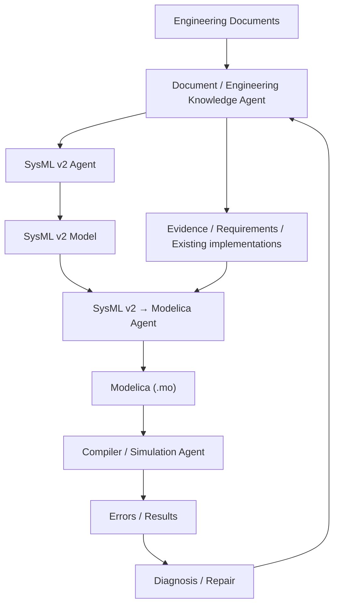

The Document Agent is NOT a one-time PDF extractor and is NOT the engineering database itself.

Core principle:

> The LLM reasons over engineering evidence; it does not become the engineering database.

The persistent engineering truth is stored outside the agent framework as source files, observations, semantic entities, relationships, requirements, evidence, uncertainty, decisions, and versions.

---

# 2. Scope of the Document Agent

The Document Agent has two major modes.

## 2.1 Ingestion mode

Used when a project is created or files change.

Responsibilities:

1. Discover files.
2. Identify file type.
3. Parse each format deterministically where possible.
4. Normalize extracted information.
5. Create observations.
6. Create indexes.
7. Extract engineering semantics.
8. Resolve entities across files.
9. Reconcile conflicting information.
10. Detect ambiguity and unknowns.
11. Record assumptions.
12. Ask humans for high-impact clarification.
13. Build the canonical semantic model.
14. Validate coverage and provenance.
15. Publish a versioned project knowledge state.

## 2.2 Retrieval / investigation mode

Used continuously by downstream agents.

Examples:

```text
SysML Agent:
"What are the temperature requirements for Zone-01?"

Modelica Agent:
"How is the existing CO2 controller implemented?"

Diagnosis Agent:
"What documented requirement could explain this simulation limit?"

Verification Agent:
"Which commissioning data validates this parameter?"
```

The Document Agent retrieves only the relevant evidence and returns compact, structured results.

---

# 3. Recommended Technology Stack

## 3.1 Language

Python 3.11+.

Reason:

- excellent document-processing ecosystem
- strong scientific/data libraries
- easy integration with OpenAI
- good async support
- easy subprocess/container integration
- suitable for LangGraph/Deep Agents

## 3.2 Agent orchestration

Recommended:

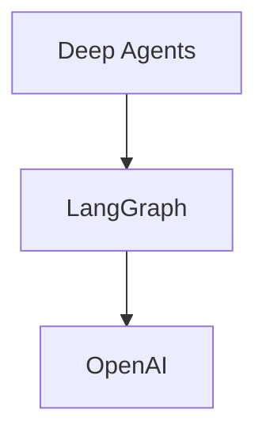

Use Deep Agents for:

- planning
- investigation
- context management
- subagent delegation
- filesystem workspace

Use LangGraph for:

- durable workflow state
- checkpoints
- branching
- retries
- human-in-the-loop interrupts
- resumable execution

Use OpenAI for:

- semantic extraction
- reasoning
- entity resolution assistance
- conflict interpretation
- ambiguity analysis
- synthesis

## 3.3 Persistent storage

MVP:

```text
Filesystem
+
JSON
+
JSONL
+
SQLite
```

Production:

```text
Object Storage
+
PostgreSQL
```

Do NOT store the complete project knowledge only inside LangGraph state.

## 3.4 Deterministic parsers

Recommended libraries:

| Format | Library / approach |
|---|---|
| PDF | PyMuPDF |
| DOCX | python-docx |
| XLSX | openpyxl |
| CSV | pandas |
| JSON | Python json |
| EML | Python email |
| Markdown | markdown-it-py or custom parser |
| TXT | pathlib |
| PNG/JPG | Pillow + OCR/vision |
| PUML | PlantUML parser/custom AST strategy |
| Modelica | Modelica parser/grammar/custom AST layer |
| ZIP | zipfile |
| XML | lxml |

Use deterministic parsing first. LLM interpretation comes after parsing.

---

# 4. Project Folder Structure

Recommended repository:

```text
engineering-agent/
│
├── pyproject.toml
├── README.md
├── .env.example
├── .gitignore
│
├── src/
│   └── engineering_agent/
│       │
│       ├── __init__.py
│       │
│       ├── config/
│       │   ├── settings.py
│       │   └── schemas.py
│       │
│       ├── agents/
│       │   ├── engineering_knowledge_agent.py
│       │   ├── document_analyst.py
│       │   ├── structured_data_analyst.py
│       │   ├── engineering_code_analyst.py
│       │   └── diagram_analyst.py
│       │
│       ├── workflows/
│       │   ├── ingestion_graph.py
│       │   ├── investigation_graph.py
│       │   ├── clarification_graph.py
│       │   └── state.py
│       │
│       ├── ingestion/
│       │   ├── file_discovery.py
│       │   ├── file_classifier.py
│       │   ├── manifest.py
│       │   └── dispatcher.py
│       │
│       ├── parsers/
│       │   ├── base.py
│       │   ├── pdf_parser.py
│       │   ├── docx_parser.py
│       │   ├── xlsx_parser.py
│       │   ├── csv_parser.py
│       │   ├── json_parser.py
│       │   ├── eml_parser.py
│       │   ├── markdown_parser.py
│       │   ├── text_parser.py
│       │   ├── image_parser.py
│       │   ├── puml_parser.py
│       │   └── modelica_parser.py
│       │
│       ├── normalization/
│       │   ├── normalize_text.py
│       │   ├── normalize_units.py
│       │   ├── normalize_names.py
│       │   └── normalize_tables.py
│       │
│       ├── observations/
│       │   ├── observation_builder.py
│       │   ├── observation_store.py
│       │   └── observation_schema.py
│       │
│       ├── extraction/
│       │   ├── entity_extractor.py
│       │   ├── relationship_extractor.py
│       │   ├── requirement_extractor.py
│       │   ├── property_extractor.py
│       │   ├── behavior_extractor.py
│       │   ├── constraint_extractor.py
│       │   └── semantic_extractor.py
│       │
│       ├── resolution/
│       │   ├── entity_resolution.py
│       │   ├── relationship_resolution.py
│       │   └── identity_rules.py
│       │
│       ├── reconciliation/
│       │   ├── conflict_engine.py
│       │   ├── precedence_rules.py
│       │   ├── supersession.py
│       │   └── temporal_resolution.py
│       │
│       ├── uncertainty/
│       │   ├── ambiguity_detector.py
│       │   ├── unknown_detector.py
│       │   ├── assumption_manager.py
│       │   └── confidence.py
│       │
│       ├── evidence/
│       │   ├── evidence_manager.py
│       │   ├── provenance.py
│       │   └── source_locator.py
│       │
│       ├── indexes/
│       │   ├── index_builder.py
│       │   ├── file_index.py
│       │   ├── topic_index.py
│       │   ├── entity_index.py
│       │   ├── requirement_index.py
│       │   ├── relationship_index.py
│       │   ├── information_type_index.py
│       │   └── evidence_index.py
│       │
│       ├── retrieval/
│       │   ├── search_service.py
│       │   ├── entity_service.py
│       │   ├── requirement_service.py
│       │   ├── evidence_service.py
│       │   ├── source_service.py
│       │   └── uncertainty_service.py
│       │
│       ├── storage/
│       │   ├── project_store.py
│       │   ├── sqlite_store.py
│       │   ├── json_store.py
│       │   └── version_store.py
│       │
│       ├── schemas/
│       │   ├── project.py
│       │   ├── document.py
│       │   ├── observation.py
│       │   ├── entity.py
│       │   ├── relationship.py
│       │   ├── requirement.py
│       │   ├── property.py
│       │   ├── behavior.py
│       │   ├── constraint.py
│       │   ├── evidence.py
│       │   ├── uncertainty.py
│       │   └── decision.py
│       │
│       ├── api/
│       │   ├── app.py
│       │   ├── routes_projects.py
│       │   ├── routes_retrieval.py
│       │   └── routes_decisions.py
│       │
│       ├── validation/
│       │   ├── schema_validator.py
│       │   ├── provenance_validator.py
│       │   ├── coverage_checker.py
│       │   └── consistency_checker.py
│       │
│       ├── security/
│       │   ├── file_security.py
│       │   ├── sandbox.py
│       │   └── permissions.py
│       │
│       └── observability/
│           ├── logging.py
│           ├── tracing.py
│           └── metrics.py
│
├── tests/
│   ├── parsers/
│   ├── extraction/
│   ├── resolution/
│   ├── reconciliation/
│   ├── retrieval/
│   ├── workflows/
│   └── fixtures/
│
├── projects/
│   └── <project_id>/
│
└── scripts/
    ├── ingest_project.py
    ├── rebuild_indexes.py
    └── inspect_project.py
```

---

# 5. Runtime Project Folder

Each engineering project gets an isolated folder.

Example:

```text
projects/
└── iaq_sysmlv2_full_dataset/
    │
    ├── source/
    │   └── original/
    │       ├── 01_requirements/
    │       ├── 02_engineering_data/
    │       ├── ...
    │       └── 09_datasets/
    │
    ├── normalized/
    │   ├── documents/
    │   ├── tables/
    │   ├── datasets/
    │   ├── diagrams/
    │   └── code/
    │
    ├── observations/
    │   └── observations.jsonl
    │
    ├── index/
    │   ├── file_index.json
    │   ├── topic_index.json
    │   ├── entity_index.json
    │   ├── requirement_index.json
    │   ├── relationship_index.json
    │   ├── information_type_index.json
    │   └── evidence_index.json
    │
    ├── semantic/
    │   ├── semantic_model.json
    │   ├── entities.json
    │   ├── relationships.json
    │   ├── properties.json
    │   ├── requirements.json
    │   ├── behaviors.json
    │   └── constraints.json
    │
    ├── evidence/
    │   └── evidence.json
    │
    ├── uncertainty/
    │   ├── unknowns.json
    │   ├── ambiguities.json
    │   ├── conflicts.json
    │   └── assumptions.json
    │
    ├── decisions/
    │   └── user_decisions.json
    │
    ├── versions/
    │   ├── v0001/
    │   ├── v0002/
    │   └── current.json
    │
    ├── reports/
    │   ├── extraction_report.json
    │   ├── coverage_report.json
    │   └── validation_report.json
    │
    └── workspace/
        └── temporary agent working files
```

Important:

```text
source/original/
```

must remain immutable.

---

# 6. Step 1 — Project Creation

Input:

```text
project_id
project name
source directory
```

Create:

```text
projects/<project_id>/
```

Generate:

```text
project_manifest.json
```

Example:

```json
{
  "project_id": "iaq_001",
  "name": "IAQ Control System",
  "created_at": "...",
  "source_root": "...",
  "status": "INGESTING",
  "knowledge_version": "v0001"
}
```

No LLM is needed.

---

# 7. Step 2 — File Discovery

Walk the source directory recursively.

For every file collect:

```text
document_id
path
filename
extension
size
sha256
modified_time
mime_type
```

Example:

```json
{
  "document_id": "doc_001",
  "path": "01_requirements/01_owner_iaq_requirements.pdf",
  "extension": ".pdf",
  "sha256": "...",
  "size": 4839201
}
```

Output:

```text
source_manifest.json
```

---

# 8. Step 3 — File Classification

Classify by:

```text
format
document role
engineering information type
authority
```

Example:

```json
{
  "document_id": "doc_001",
  "format": "PDF",
  "role": "PROJECT_REQUIREMENT",
  "information_types": [
    "REQUIREMENTS",
    "CONSTRAINTS"
  ]
}
```

Possible roles:

```text
PROJECT_REQUIREMENT
ENGINEERING_DATA
DESIGN_DECISION
DESIGN_NOTE
CORRESPONDENCE
LEGACY_IMPLEMENTATION
DATASHEET
COMMISSIONING
MEASUREMENT
REFERENCE
DIAGRAM
ARCHITECTURE
OPERATOR_NOTE
USER_STATEMENT
```

This classification may use rules first and LLM second.

---

# 9. Step 4 — Deterministic Parsing

The dispatcher selects a parser.

```text
PDF → pdf_parser
DOCX → docx_parser
XLSX → xlsx_parser
CSV → csv_parser
JSON → json_parser
EML → eml_parser
PNG/JPG → image_parser
PUML → puml_parser
MO → modelica_parser
```

Each parser returns normalized observations.

The parser should NEVER directly create final semantic entities.

---

# 10. Step 5 — PDF Processing

Extract:

```text
page
heading
paragraph
table
figure
caption
```

Example:

```json
{
  "observation_id": "obs_1001",
  "type": "TEXT",
  "content": "Zone temperature shall remain between 20 and 24 degC.",
  "location": {
    "page": 8,
    "section": "4.2 Temperature"
  }
}
```

If the PDF is scanned:

```text
PDF
 ↓
OCR
 ↓
text observations
```

Retain page coordinates where available.

---

# 11. Step 6 — XLSX Processing

Never flatten an engineering register into prose.

Preserve:

```text
workbook
sheet
table
row
column
cell
formula
displayed value
unit
```

Example:

```json
{
  "type": "CELL",
  "content": "24",
  "location": {
    "sheet": "Requirements",
    "cell": "F17"
  }
}
```

Create table-level metadata:

```text
sheet_name
headers
units
row_count
column_count
```

---

# 12. Step 7 — CSV Processing

Extract metadata first:

```text
columns
types
units
row count
time column
sampling period
min/max
missing count
```

Do NOT send a 100,000-row CSV to the LLM.

Example retrieval:

```text
get_dataset_statistics("reference_run_24h.csv")
get_dataset_rows(file, start_time, end_time)
get_dataset_column(file, "CO2")
```

The dataset remains queryable.

---

# 13. Step 8 — JSON Processing

Preserve JSON paths.

Example:

```text
rooms[3].equipment[1].setpoint
```

Store:

```json
{
  "path": "rooms[3].equipment[1].setpoint",
  "value": 24
}
```

This makes exact provenance possible.

---

# 14. Step 9 — EML Processing

Reconstruct email threads.

Extract:

```text
sender
recipient
date
subject
message body
reply chain
decisions
questions
approvals
corrections
```

Email ordering matters.

A later approved email may supersede an earlier design note.

---

# 15. Step 10 — Image / Diagram Processing

Pipeline:

```text
Image
 ↓
OCR
 ↓
Vision model
 ↓
Structured diagram observations
```

Extract:

```text
labels
components
ports
arrows
connections
boundaries
direction
text
```

Example:

```json
{
  "type": "DIAGRAM_RELATION",
  "source": "AHU-01",
  "target": "VAV-01",
  "relation": "SUPPLIES",
  "location": {
    "bbox": [120, 200, 500, 400]
  }
}
```

Vision-derived facts should remain explicitly marked as image observations.

---

# 16. Step 11 — PUML Processing

Use AST/parser extraction where possible.

Extract:

```text
classes
components
interfaces
relationships
inheritance
composition
dependencies
labels
```

Example:

```text
AHU --> Controller : controlledBy
```

becomes:

```json
{
  "source": "AHU",
  "target": "Controller",
  "relation": "CONTROLLED_BY",
  "evidence_type": "DIAGRAM_RELATION"
}
```

---

# 17. Step 12 — Modelica Processing

Treat `.mo` as source code.

Parse:

```text
packages
classes
models
blocks
components
parameters
variables
connectors
equations
algorithms
extends
connections
annotations
```

Example:

```modelica
connect(sensor.CO2, controller.CO2);
```

becomes:

```json
{
  "type": "CODE",
  "content": "sensor.CO2 -> controller.CO2",
  "location": {
    "file": "07_legacy_co2_control.mo",
    "line": 42
  }
}
```

Do not execute Modelica during ingestion.

Execution belongs to the later compiler/simulation subsystem.

---

# 18. Step 13 — Observation Store

All parser outputs become observations.

File:

```text
observations/observations.jsonl
```

Example:

```json
{
  "observation_id": "obs_001",
  "document_id": "doc_001",
  "type": "TEXT",
  "content": "...",
  "location": {
    "page": 12,
    "section": "Control Requirements"
  },
  "parser": "pdf_parser",
  "parser_version": "1.0"
}
```

Observations are immutable.

If a source file changes, create new observations for the new source version.

---

# 19. Step 14 — Build the Initial Indexes

Build:

```text
file_index.json
topic_index.json
entity_index.json
requirement_index.json
relationship_index.json
information_type_index.json
evidence_index.json
```

These are navigation structures.

They are NOT the final semantic truth.

---

# 20. file_index.json

Purpose:

> Tell agents what every file contains.

Example:

```json
{
  "doc_001": {
    "path": "01_requirements/01_owner_iaq_requirements.pdf",
    "role": "PROJECT_REQUIREMENT",
    "topics": [
      "temperature",
      "CO2",
      "occupancy"
    ],
    "contains": [
      "requirements",
      "constraints"
    ]
  }
}
```

---

# 21. topic_index.json

Example:

```json
{
  "CO2_CONTROL": {
    "documents": [
      "doc_001",
      "doc_005",
      "doc_007"
    ]
  },
  "TEMPERATURE_CONTROL": {
    "documents": [
      "doc_001",
      "doc_004"
    ]
  }
}
```

---

# 22. entity_index.json

Example:

```json
{
  "AHU-01": {
    "observations": [
      "obs_100",
      "obs_220"
    ],
    "sources": [
      "doc_001",
      "doc_004"
    ]
  }
}
```

Locations are included.

---

# 23. requirement_index.json

Example:

```json
{
  "REQ-001": {
    "sources": [
      {
        "document_id": "doc_001",
        "page": 8
      },
      {
        "document_id": "doc_002",
        "sheet": "Requirements",
        "cell": "F17"
      }
    ]
  }
}
```

---

# 24. information_type_index.json

Map information categories to sources.

Example:

```json
{
  "PROJECT_REQUIREMENT": [
    "doc_001"
  ],
  "CONTROL_LOGIC": [
    "doc_004",
    "doc_005",
    "doc_007"
  ],
  "COMMISSIONING_DATA": [
    "doc_009",
    "doc_011"
  ],
  "LEGACY_IMPLEMENTATION": [
    "doc_007"
  ]
}
```

This is extremely useful for downstream agents.

---

# 25. Step 15 — Semantic Extraction

After deterministic parsing, use an LLM for semantic interpretation.

Do NOT send all project text to one prompt.

Use batches:

```text
related observations
        ↓
LLM
        ↓
structured semantic facts
```

Extract:

```text
entities
relationships
properties
requirements
behaviors
constraints
interfaces
states
assumptions
```

Use structured JSON/Pydantic output.

---

# 26. Entity Schema

Example:

```json
{
  "entity_id": "ent_001",
  "name": "AHU-01",
  "type": "AirHandlingUnit",
  "status": "EXPLICIT",
  "evidence": [
    "obs_1001"
  ]
}
```

Allowed statuses:

```text
EXPLICIT
CONFIRMED
INFERRED
ASSUMED
PROPOSED
AMBIGUOUS
CONFLICTED
UNKNOWN
USER_CONFIRMED
EXTERNAL_REFERENCE
```

---

# 27. Relationship Extraction

Extract relationships such as:

```text
contains
part_of
composed_of
connected_to
supplies
serves
controls
regulates
requires
depends_on
triggers
causes
responds_to
air_flow
water_flow
signal_flow
electrical_flow
```

Every relationship needs evidence.

---

# 28. Requirement Extraction

Represent:

```text
subject
property
operator
value
unit
condition
source
status
```

Example:

```json
{
  "requirement_id": "REQ-001",
  "subject": "Zone-01",
  "property": "temperature",
  "constraint": {
    "min": 20,
    "max": 24,
    "unit": "degC"
  },
  "status": "EXPLICIT",
  "evidence": ["obs_102"]
}
```

---

# 29. Behavior Extraction

Example:

```text
IF CO2 > 1000 ppm
THEN increase ventilation
```

Represent:

```json
{
  "behavior_id": "BEH-001",
  "trigger": {
    "property": "CO2",
    "operator": ">",
    "value": 1000,
    "unit": "ppm"
  },
  "action": {
    "type": "INCREASE",
    "target": "ventilation"
  },
  "status": "EXPLICIT",
  "evidence": ["obs_200"]
}
```

---

# 30. Step 16 — Entity Resolution

Different sources may say:

```text
AHU-01
AHU 1
AHU_01
Air Handling Unit 1
```

The resolution engine creates candidate matches.

Possible outcomes:

```text
SAME_ENTITY
POSSIBLE_SAME_ENTITY
DIFFERENT_ENTITY
UNKNOWN
```

Do not merge solely on name similarity.

Use:

```text
name
type
location
relationships
parameters
source context
document authority
```

LLM can propose matches, but the final result must remain evidence-backed.

---

# 31. Step 17 — Conflict Detection

Example:

```text
PDF:
CO2 = 1000 ppm

Engineering register:
CO2 = 900 ppm

Legacy Modelica:
CO2 = 1000 ppm

Later approved email:
CO2 = 900 ppm
```

The system should preserve all claims.

Conflict engine determines:

```text
same requirement?
different revision?
different operating mode?
superseded?
actual conflict?
```

Never silently overwrite the old value.

---

# 32. Precedence Rules

Define configurable source authority.

Example:

```text
USER_CONFIRMED
    >
LATEST_APPROVED_PROJECT_REQUIREMENT
    >
PROJECT_REQUIREMENT
    >
ENGINEERING_REGISTER
    >
DESIGN_NOTE
    >
LEGACY_IMPLEMENTATION
    >
ENGINEER_SCRATCH_NOTE
```

This is an example policy, not a universal engineering rule.

Make it configurable per project.

---

# 33. Supersession

Represent:

```json
{
  "claim_id": "claim_100",
  "status": "SUPERSEDED",
  "superseded_by": "claim_150"
}
```

Never delete historical claims.

---

# 34. Step 18 — Ambiguity Detection

Ambiguity means the source does not clearly determine one interpretation.

Example:

```text
"AHU is connected to heating system."
```

Possible interpretations:

```text
heating coil
hot water loop
heating plant
```

Create:

```json
{
  "ambiguity_id": "AMB-001",
  "question": "What does heating system mean?",
  "candidates": [
    "HEATING_COIL",
    "HOT_WATER_LOOP",
    "HEATING_PLANT"
  ],
  "impact": "HIGH",
  "status": "OPEN"
}
```

---

# 35. Step 19 — Unknown Detection

Unknown means the information is required but not available.

Example:

```json
{
  "unknown_id": "UNK-001",
  "property": "supply_temperature",
  "entity": "AHU-01",
  "reason": "No source specifies the value",
  "status": "OPEN"
}
```

Never invent missing engineering values.

---

# 36. Step 20 — Assumption Management

An agent may need to propose an interpretation.

Example:

```json
{
  "assumption_id": "A-001",
  "statement": "The term controlled means functional control relationship.",
  "status": "PROPOSED",
  "requires_confirmation": true
}
```

An assumption is NOT a fact.

---

# 37. Step 21 — Human-in-the-Loop

Human input should happen only when it changes engineering meaning or blocks downstream generation.

Do NOT ask:

```text
"This sentence is slightly ambiguous. Is that okay?"
```

for every minor issue.

Ask when:

```text
high-impact ambiguity
critical conflicting requirement
missing safety-critical parameter
entity identity uncertain
multiple valid architectures
approval required
```

---

# 38. Human Clarification Workflow

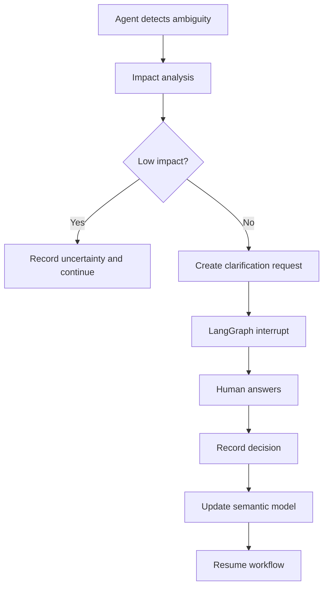

Example:

```text
Question:
"Heating system" is referenced for AHU-01.

Should this be interpreted as:
1. Heating coil
2. Hot-water loop
3. Heating plant

This affects the system architecture.
```

---

# 39. Decision Ledger

File:

```text
decisions/user_decisions.json
```

Example:

```json
{
  "decision_id": "DEC-001",
  "question": "What does heating system mean?",
  "answer": "Heating coil",
  "source": "USER",
  "timestamp": "...",
  "affects": [
    "rel_103"
  ]
}
```

Future agents reuse this decision.

Do not ask the same question again.

---

# 40. Step 22 — Semantic Model Builder

Combine:

```text
entities
relationships
properties
requirements
behaviors
constraints
evidence
decisions
uncertainty
```

into:

```text
semantic/semantic_model.json
```

Example structure:

```json
{
  "model_version": "v001",
  "entities": [],
  "relationships": [],
  "properties": [],
  "requirements": [],
  "behaviors": [],
  "constraints": [],
  "uncertainties": [],
  "assumptions": [],
  "decisions": []
}
```

---

# 41. Step 23 — Evidence Model

Every important semantic fact must point to evidence.

Example:

```json
{
  "evidence_id": "EV-100",
  "fact_id": "REQ-001",
  "type": "EXPLICIT_TEXT",
  "document_id": "doc_001",
  "location": {
    "page": 8,
    "section": "4.2"
  },
  "quote": "..."
}
```

Keep quotes short where licensing/copyright matters.

For code:

```text
file
class
line
```

For Excel:

```text
sheet
cell
```

For JSON:

```text
path
```

For images:

```text
bbox
```

---

# 42. Step 24 — Quality / Coverage Check

Before publishing a knowledge version, check:

```text
Are all files processed?
Are parser failures recorded?
Are important entities evidenced?
Are requirements evidenced?
Are relationships evidenced?
Are conflicts recorded?
Are ambiguities recorded?
Are unknowns recorded?
Are user decisions applied?
```

Generate:

```text
reports/extraction_report.json
reports/coverage_report.json
reports/validation_report.json
```

---

# 43. Parser Failure Handling

Never silently skip a file.

Example:

```json
{
  "document_id": "doc_020",
  "status": "FAILED",
  "error": "Unable to parse PDF",
  "retry_count": 2
}
```

If parsing fails:

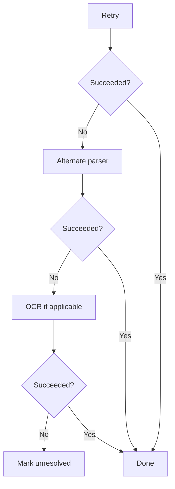

The project can continue while reporting incomplete coverage.

---

# 44. Retrieval API

Downstream agents should NEVER directly inspect the project folder.

Expose tools/APIs.

Core tools:

```text
search_files()
search_topics()
search_entities()
search_requirements()
search_relationships()
get_entity()
get_requirement()
get_relationship()
get_observations()
get_evidence()
get_source_section()
get_conflicts()
get_ambiguities()
get_unknowns()
get_decisions()
get_dataset_statistics()
get_dataset_rows()
get_modelica_class()
```

---

# 45. Retrieval Example — SysML Agent

SysML Agent asks:

```text
What are the requirements for IAQ control?
```

Document Agent:

```text
search_requirements("IAQ control")
```

returns:

```text
REQ-001
REQ-004
REQ-007
```

Then:

```text
get_evidence(REQ-001)
```

returns:

```text
PDF page 8
Engineering register sheet Requirements cell F17
```

Only those relevant sections are passed to the SysML agent.

---

# 46. Retrieval Example — Modelica Agent

Modelica Agent asks:

```text
Find the existing CO2 control implementation.
```

Document Agent:

```text
search_entities("CO2 controller")
search_topics("CO2_CONTROL")
```

returns:

```text
07_legacy_co2_control.mo
04_control_sequence_and_modeling_notes.docx
05_bms_controls_email_thread.eml
```

Then the Modelica agent retrieves the specific classes/sections it needs.

---

# 47. Retrieval Example — Diagnosis Agent

Suppose simulation produces:

```text
CO2 controller oscillates.
```

Diagnosis Agent asks:

```text
get_requirements("CO2")
get_behaviors("CO2")
get_legacy_implementation("CO2 controller")
get_commissioning_data("CO2")
get_conflicts("CO2")
```

The Document Agent provides the evidence needed to diagnose the issue.

---

# 48. No Full-Project Context

Never create:

```text
all_documents.txt
```

and send it to the LLM.

Instead:

```text
question
 ↓
index
 ↓
candidate sources
 ↓
targeted observations
 ↓
source section
 ↓
LLM reasoning
```

This is the central retrieval architecture.

---

# 49. LLM Prompt Architecture

Use separate prompts for separate semantic tasks.

Examples:

```text
ENTITY_EXTRACTION_PROMPT
RELATIONSHIP_EXTRACTION_PROMPT
REQUIREMENT_EXTRACTION_PROMPT
BEHAVIOR_EXTRACTION_PROMPT
ENTITY_RESOLUTION_PROMPT
CONFLICT_ANALYSIS_PROMPT
AMBIGUITY_ANALYSIS_PROMPT
```

Do not use one giant prompt:

```text
"Understand this entire project."
```

---

# 50. Structured Outputs

All LLM extraction should use strict schemas.

Example:

```python
class RequirementExtraction(BaseModel):
    requirement_id: str | None
    subject: str
    property: str
    operator: str
    value: float | str
    unit: str | None
    evidence_ids: list[str]
```

Reject invalid output.

Retry with a corrected prompt when necessary.

---

# 51. Agent Architecture

Main agent:

```text
EngineeringKnowledgeAgent
```

Tools:

```text
search_files
search_topics
search_entities
get_entity
get_requirement
get_relationship
get_evidence
get_source_section
get_conflicts
get_ambiguities
get_unknowns
get_decisions
```

Internal specialist agents:

```text
DocumentAnalyst
StructuredDataAnalyst
EngineeringCodeAnalyst
DiagramAnalyst
```

Do not create one agent per file.

---

# 52. LangGraph Ingestion Graph

Recommended graph:

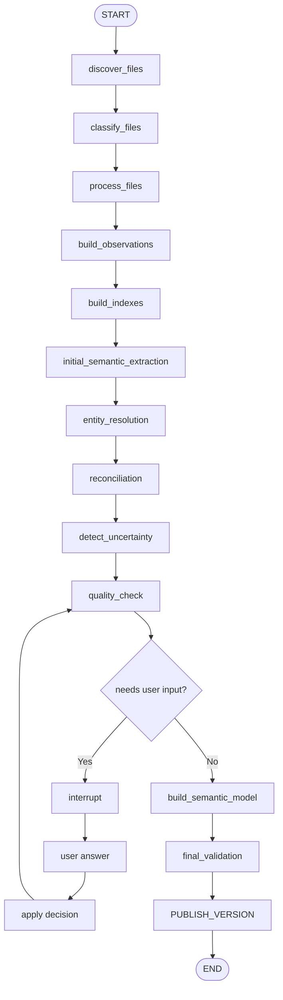

---

# 53. LangGraph State

Keep state small.

Example:

```python
class KnowledgeState(TypedDict):
    project_id: str
    workflow_id: str
    current_phase: str

    files_to_process: list[str]
    processed_files: list[str]
    failed_files: list[str]

    observations_created: list[str]

    entities_found: list[str]
    relationships_found: list[str]
    requirements_found: list[str]

    conflicts: list[str]
    ambiguities: list[str]
    unknowns: list[str]

    pending_questions: list[str]

    model_version: str
    errors: list[str]
```

Do NOT store large document contents in state.

---

# 54. Investigation Graph

Retrieval/investigation should be separate from ingestion.

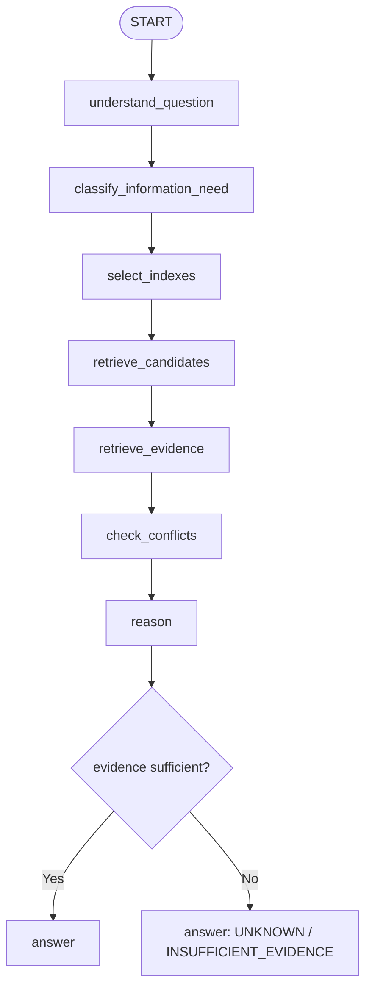

Do not fabricate.

---

# 55. Human-in-the-Loop Locations

There are four main HITL points.

## HITL-1: Source interpretation

When a critical document classification is uncertain.

## HITL-2: Entity resolution

When two entities may be the same and the difference changes architecture.

## HITL-3: Conflict resolution

When two requirements conflict and no precedence rule resolves them.

## HITL-4: Missing/ambiguous engineering decision

When generation cannot safely continue.

Example:

```text
SysML generation requires:
maximum CO2 setpoint.

Sources disagree:
900 ppm vs 1000 ppm.

No approved/latest source identified.

Ask human.
```

---

# 56. What Does NOT Need HITL

Usually do not interrupt for:

```text
minor spelling differences
formatting differences
obvious filename aliases
low-impact inferred relationships
duplicate observations
non-critical parser normalization
```

Record them automatically.

---

# 57. Versioning

Every meaningful knowledge change creates a version.

Example:

```text
v0001
v0002
v0003
```

Version metadata:

```json
{
  "version": "v0003",
  "created_at": "...",
  "parent": "v0002",
  "reason": "User confirmed CO2 requirement",
  "changed_entities": [],
  "changed_requirements": []
}
```

Never destroy historical versions.

---

# 58. Incremental Ingestion

When a file changes:

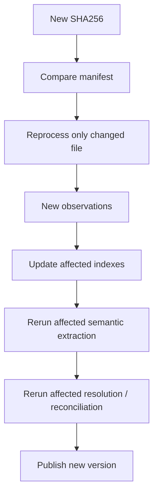

Do not reprocess the entire project unnecessarily.

---

# 59. Dependency Tracking

Maintain:

```text
fact → evidence
fact → derived facts
fact → affected agents
```

Example:

```text
REQ-001
  ↓
Behavior BEH-002
  ↓
SysML requirement
  ↓
Modelica parameter
```

If REQ-001 changes, affected downstream artifacts can be identified.

---

# 60. Security

Never execute arbitrary source files during document ingestion.

Especially:

```text
Modelica
Python
shell scripts
unknown binaries
macros
```

Parsing is different from execution.

For the Compiler / Simulation Agent (see `Compiler Agent.md`, which implements this in full):

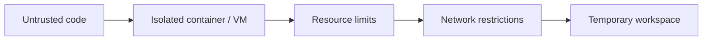

Deep Agents' filesystem access should not be treated as a security sandbox.

---

# 61. Workspace Separation

Use:

```text
source/original/
```

read-only.

Use:

```text
workspace/
```

for temporary agent files.

Use:

```text
semantic/
index/
evidence/
```

for controlled generated artifacts.

Agents should not freely overwrite canonical files.

---

# 62. Observability

Record:

```text
workflow_id
project_id
agent
tool
input summary
output summary
latency
token usage
errors
retry
human interruption
version
```

Do not log secrets.

This is important for debugging the multi-agent system.

---

# 63. Testing Strategy

## Unit tests

Test every parser independently.

Example:

```text
test_pdf_parser.py
test_xlsx_parser.py
test_modelica_parser.py
```

## Semantic extraction tests

Use fixed observations and expected JSON.

## Resolution tests

Test:

```text
AHU-01
AHU 1
AHU_01
```

## Conflict tests

Test:

```text
900 ppm vs 1000 ppm
```

## HITL tests

Verify graph pauses and resumes correctly.

## Retrieval tests

Ask known questions and verify expected evidence is returned.

---

# 64. Golden Dataset

Use the four available datasets as integration test projects:

```text
IAQ
Magnetic Circuit
NaCl Evaporation
Tank
```

Each should have:

```text
expected entities
expected relationships
expected requirements
expected behaviors
expected conflicts
expected unknowns
expected evidence links
```

Do not require the LLM to produce byte-identical output. Validate semantic correctness and provenance.

---

# 65. Complete Implementation Scope

The Document Agent is built as **one coherent system**, not as a sequence of gated releases. There is no partial "MVP that skips features" milestone — every component below is part of the single implementation target. The list is grouped by subsystem purely for readability; it ships together, and the [dependency-ordered build sequence](#70-recommended-build-order-dependency-sequence) at the end of this document determines *what gets coded first*, not *what gets skipped*.

## 65.1 Foundation

```text
project manager
file discovery + manifest
folder structure
Pydantic schemas
SQLite store
```

## 65.2 Deterministic ingestion

```text
PDF, DOCX, XLSX, CSV, JSON, EML, TXT, MD
PNG/JPG (OCR + vision)
PUML
MO (Modelica, parse-only — no execution)
```

Deliverable: `observations/observations.jsonl`.

## 65.3 Indexing

```text
file_index.json
topic_index.json
entity_index.json
requirement_index.json
relationship_index.json
information_type_index.json
evidence_index.json
```

## 65.4 Semantic extraction

```text
entities, relationships, properties
requirements, behaviors, constraints
```

Using OpenAI structured outputs. Deliverable: `semantic/*.json`.

## 65.5 Evidence

`fact → evidence` links with exact source locations. Deliverable: `evidence/evidence.json`.

## 65.6 Resolution

Entity resolution and relationship normalization. Deliverable: resolved semantic model.

## 65.7 Uncertainty

Conflicts, ambiguities, unknowns, assumptions. Deliverable: `uncertainty/*.json`.

## 65.8 Human-in-the-loop

LangGraph interrupt/resume, producing:


## 65.9 Retrieval API

```text
search_files, search_topics, search_entities, search_requirements
get_evidence, get_source_section, get_conflicts, get_unknowns, get_decisions
```

Deliverable: downstream agents can query knowledge directly, without touching the project folder.

## 65.10 Deep Agent wrapper

Wrap the retrieval tools in the `EngineeringKnowledgeAgent`, responsible for: plan investigation, select tools, retrieve evidence, reason, ask clarification, synthesize response.

## 65.11 Downstream agent contracts

The Document Agent produces the contracts consumed by the rest of the pipeline — it does not implement them itself:

```text
SysML v2 Agent         → consumes requirements, entities, relationships,
                          behaviors, constraints, evidence (see SysML V2 Agent.md)
SysML → Modelica Agent → consumes SysML model, engineering knowledge, legacy
                          Modelica, parameters, control logic (see Modelica Agent.md)
Compiler / Simulation  → consumes Modelica (.mo), runs compile/simulate/verify,
Agent                    returns errors/results (see Compiler Agent.md)
```

The Document Agent remains fully independent of all three — it never imports SysML, Modelica, or compiler concerns into its own code.

## 65.12 Formats, outputs, and tools delivered as one system

Supported source formats:

```text
PDF, DOCX, XLSX, CSV, JSON, MD, TXT, EML, MO
PNG/JPG, PUML, ZIP, XML
```

Full output set:

```text
source_manifest.json
observations.jsonl

file_index.json
topic_index.json
entity_index.json
requirement_index.json
relationship_index.json
information_type_index.json
evidence_index.json

entities.json
relationships.json
requirements.json
behaviors.json
constraints.json

evidence.json

unknowns.json
ambiguities.json
conflicts.json
assumptions.json
user_decisions.json

semantic_model.json
```

Full retrieval tool surface:

```text
search_files()          search_topics()        search_entities()
search_requirements()   search_relationships()
get_entity()            get_requirement()      get_relationship()
get_observations()      get_evidence()         get_source_section()
get_conflicts()         get_ambiguities()      get_unknowns()
get_decisions()         get_dataset_statistics()
get_dataset_rows()      get_modelica_class()
```

---

# 66. Example End-to-End IAQ Flow

Input:

```text
01_owner_iaq_requirements.pdf
02_iaq_engineering_register.xlsx
04_control_sequence_and_modeling_notes.docx
05_bms_controls_email_thread.eml
07_legacy_co2_control.mo
08_co2_sensor_datasheet.pdf
09_commissioning_test_procedure_CP23.pdf
10_occupancy_schedule.csv
11_reference_run_24h.csv
12_bim_room_export.json
```

Processing:

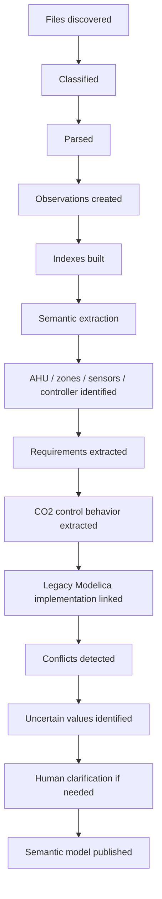

Later, across the whole pipeline:

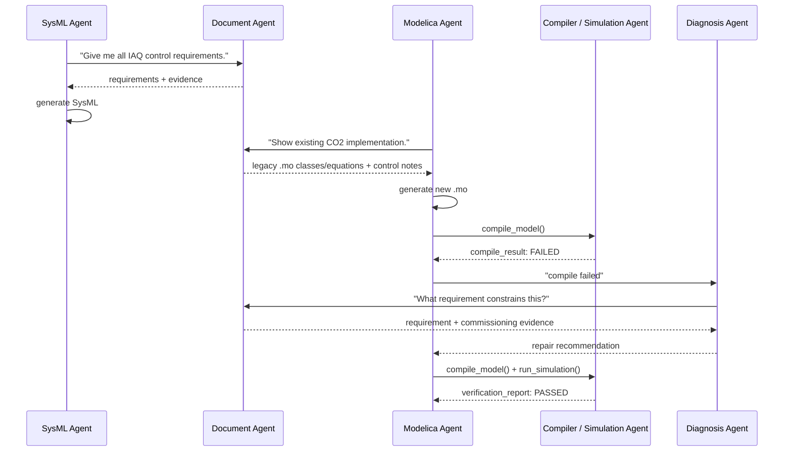

---

# 67. Key Architectural Boundaries

## Document Agent owns

```text
source understanding
observations
indexes
semantic knowledge
evidence
uncertainty
decisions
retrieval
```

## SysML Agent owns

```text
SysML v2 modeling
SysML syntax
SysML architecture
SysML validation
```

## Modelica Agent owns

```text
Modelica modeling
component mapping
equations
connectors
Modelica code generation
```

## Compiler / Simulation Agent owns

```text
compile
compiler diagnostics
build environment
simulation
simulation configuration
result extraction
requirement verification against results
```

Fully specified in `Compiler Agent.md`.

## Diagnosis Agent owns

```text
failure analysis
hypothesis generation
evidence requests
repair recommendations
```

---

# 68. Critical Design Rules

1. Never treat LLM output as unquestioned truth.
2. Every important fact needs evidence.
3. Never silently overwrite conflicting information.
4. Never invent unknown engineering values.
5. Distinguish explicit facts from inference.
6. Preserve historical versions.
7. Keep source files immutable.
8. Keep large source content outside LangGraph state.
9. Use indexes for navigation.
10. Retrieve only relevant evidence for reasoning.
11. Use deterministic parsers before LLM interpretation.
12. Use human approval for high-impact unresolved decisions.
13. Keep agent orchestration separate from persistent engineering knowledge.
14. Do not execute untrusted code during document ingestion.
15. Make source provenance available to every downstream agent.
16. Make retrieval framework-independent.
17. Make source authority configurable.
18. Make every generated semantic object traceable.
19. Make incremental updates possible.
20. Keep the Document Agent reusable by every future engineering agent.

---

# 69. Final Target Architecture

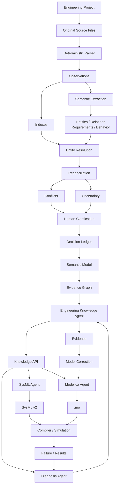

---

# 70. Recommended Build Order (Dependency Sequence)

Implement in this exact order:

```text
1. project_store.py
2. Pydantic schemas
3. file_discovery.py
4. manifest.py
5. parser interfaces
6. PDF parser
7. DOCX parser
8. XLSX parser
9. CSV parser
10. JSON parser
11. EML parser
12. MD/TXT parser
13. observation_store.py
14. index_builder.py
15. file/topic/information indexes
16. semantic extraction schemas
17. LLM semantic extractor
18. evidence manager
19. entity resolution
20. conflict engine
21. ambiguity/unknown/assumption managers
22. SQLite retrieval services
23. LangGraph ingestion workflow
24. HITL interrupt/resume
25. investigation workflow
26. Deep Engineering Knowledge Agent
27. retrieval API/tools
28. integration tests using IAQ dataset
29. integration tests using remaining datasets
30. SysML Agent integration (see SysML V2 Agent.md)
31. Modelica Agent integration (see Modelica Agent.md)
32. Compiler / Simulation Agent integration (see Compiler Agent.md)
```

This ordering prevents building the agent first and discovering later that there is no reliable engineering data layer underneath it. It is a dependency order, not a phase gate — the whole system above is the target, built in this sequence.
