# SysML v2 → Modelica Agent — Detailed Implementation Plan

> Part of a four-agent pipeline. See also: [`Document Agent.md`](./Document%20Agent.md) (Engineering Knowledge Agent), [`SysML V2 Agent.md`](./SysML%20V2%20Agent.md), [`Compiler Agent.md`](./Compiler%20Agent.md) (Compiler / Simulation Agent), [`Agent Contracts.md`](./Agent%20Contracts.md) (the typed schema for every payload exchanged between these agents), and the top-level [`README.md`](./README.md) for the unified architecture.

The next agent after the SysML v2 Creator Agent is the **SysML → Modelica Agent**.

This agent is different from the SysML Creator: its job is not simply to convert text syntax. It performs an engineering model transformation.

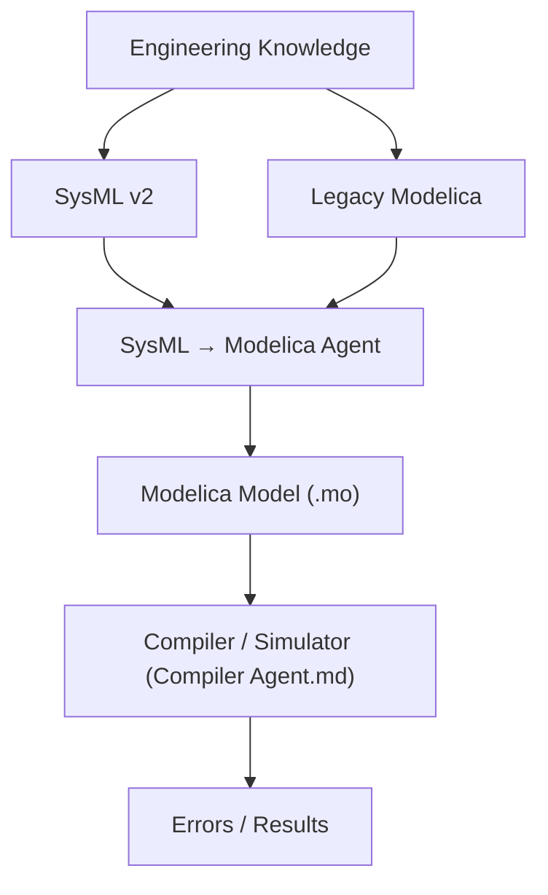

---

## 1. What This Agent Should Actually Do

The agent should answer:

> Given the validated SysML model and the engineering knowledge, what Modelica implementation represents that system correctly?

It needs to determine:

```text
which SysML elements become Modelica classes/components
which properties become parameters/variables
which SysML relationships become Modelica connections
which behaviors become equations/algorithms/control blocks
which interfaces become Modelica connectors
which constraints become Modelica assertions/parameters/validation logic
which existing Modelica classes can be reused
which Modelica library components are appropriate
what information is missing
whether the generated Modelica actually compiles
how compiler/simulation errors should be diagnosed
```

---

## 2. The Most Important Architecture Decision

Do not build:

```text
SysML text → LLM → Modelica text
```

Instead:

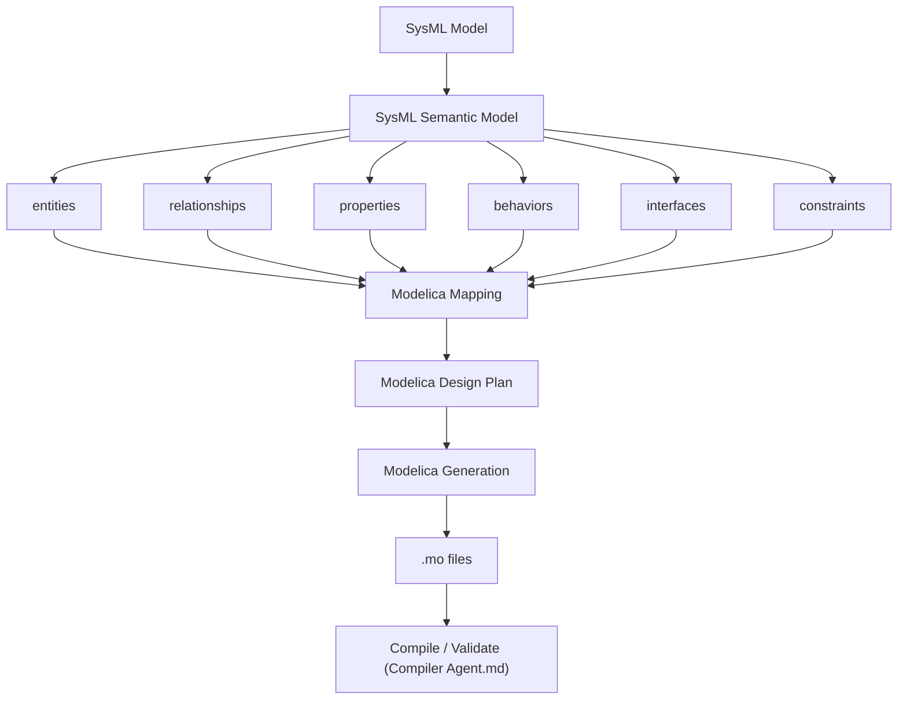

The mapping layer is extremely important — it is the difference between "an LLM guessed some Modelica" and "a traceable engineering transformation."

---

## 3. Overall Architecture

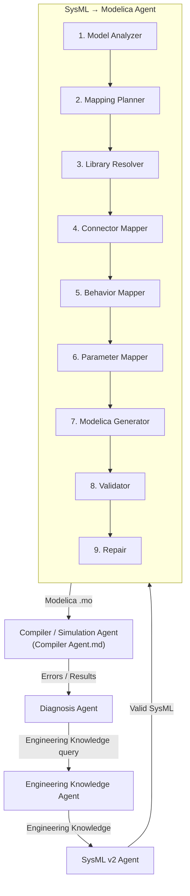

---

## 4. Inputs to the Modelica Agent

The agent has four major inputs.

### Input 1 — SysML model (`sysml/generated/`)

```text
Architecture.sysml
Requirements.sysml
Interfaces.sysml
Behaviors.sysml
Constraints.sysml
```

### Input 2 — SysML semantic representation

Not just source text:

```json
{
  "element_id": "part_001",
  "name": "CO2Sensor",
  "type": "Sensor",
  "properties": []
}
```

### Input 3 — Engineering Knowledge Agent

The Modelica Agent should be able to ask:

```text
What is the actual sensor range?
What unit is used?
What is the control behavior?
Is there an existing Modelica implementation?
What does the datasheet specify?
What did commissioning show?
```

### Input 4 — Existing Modelica

The golden datasets already contain:

```text
07_legacy_co2_control.mo
07_legacy_magnetic_circuit.mo
07_legacy_evaporation_plant.mo
07_legacy_tank_demo.mo
```

These are extremely valuable. The agent should reuse existing implementations where appropriate, rather than regenerate everything from scratch.

---

## 5. Internal Folder Structure

```text
src/
└── engineering_agent/
    │
    └── modelica/
        │
        ├── agent.py
        │
        ├── planning/
        │   ├── modelica_planner.py
        │   └── generation_plan.py
        │
        ├── analysis/
        │   ├── sysml_analyzer.py
        │   ├── modelica_analyzer.py
        │   └── semantic_analyzer.py
        │
        ├── mapping/
        │   ├── element_mapper.py
        │   ├── property_mapper.py
        │   ├── relationship_mapper.py
        │   ├── connector_mapper.py
        │   ├── behavior_mapper.py
        │   ├── requirement_mapper.py
        │   └── constraint_mapper.py
        │
        ├── libraries/
        │   ├── library_resolver.py
        │   ├── library_catalog.py
        │   └── compatibility.py
        │
        ├── generation/
        │   ├── package_generator.py
        │   ├── model_generator.py
        │   ├── connector_generator.py
        │   ├── equation_generator.py
        │   ├── parameter_generator.py
        │   └── modelica_generator.py
        │
        ├── validation/
        │   ├── syntax_validator.py
        │   ├── structure_validator.py
        │   ├── connection_validator.py
        │   ├── unit_validator.py
        │   ├── parameter_validator.py
        │   └── semantic_validator.py
        │
        ├── compiler_client/
        │   └── compiler_agent_client.py    # calls Compiler Agent.md tools
        │
        ├── diagnosis/
        │   ├── error_classifier.py
        │   └── repair_planner.py
        │
        ├── repair/
        │   └── modelica_repair.py
        │
        ├── traceability/
        │   └── modelica_traceability.py
        │
        └── schemas/
            ├── mapping.py
            ├── generation_plan.py
            ├── validation.py
            ├── compiler_result.py
            └── traceability.py
```

---

## 6. Step 1 — Analyze SysML

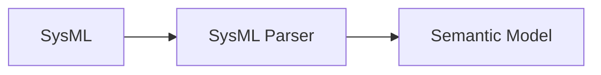

Extract: parts, attributes, ports, interfaces, relationships, requirements, behaviors, constraints. The agent shouldn't rely only on an LLM to understand the SysML — use parser/AST information wherever possible.

---

## 7. Step 2 — Build the Modelica Generation Contract

Similar to the SysML Generation Contract, create `modelica/input/modelica_generation_contract.json`:

```json
{
  "project_id": "iaq_001",
  "sysml_version": "v0004",
  "knowledge_version": "v0008",

  "components": [],
  "properties": [],
  "interfaces": [],
  "behaviors": [],
  "constraints": [],

  "legacy_models": ["07_legacy_co2_control.mo"]
}
```

This becomes the controlled input to the Modelica Agent.

---

## 8. Step 3 — Modelica Mapping Plan

Before generating `.mo`, create `modelica/plan/modelica_mapping.json`:

```json
{
  "sysml_element": "CO2Sensor",
  "modelica_mapping": {
    "type": "MODEL",
    "target": "Modelica.Blocks.Interfaces.RealInput"
  },
  "reason": "Sensor output represented as scalar signal",
  "evidence": ["EV-120"]
}
```

The mapping must be explicit — never implicit in generated code with no record of why.

---

## 9. Different SysML Concepts Need Different Modelica Mappings

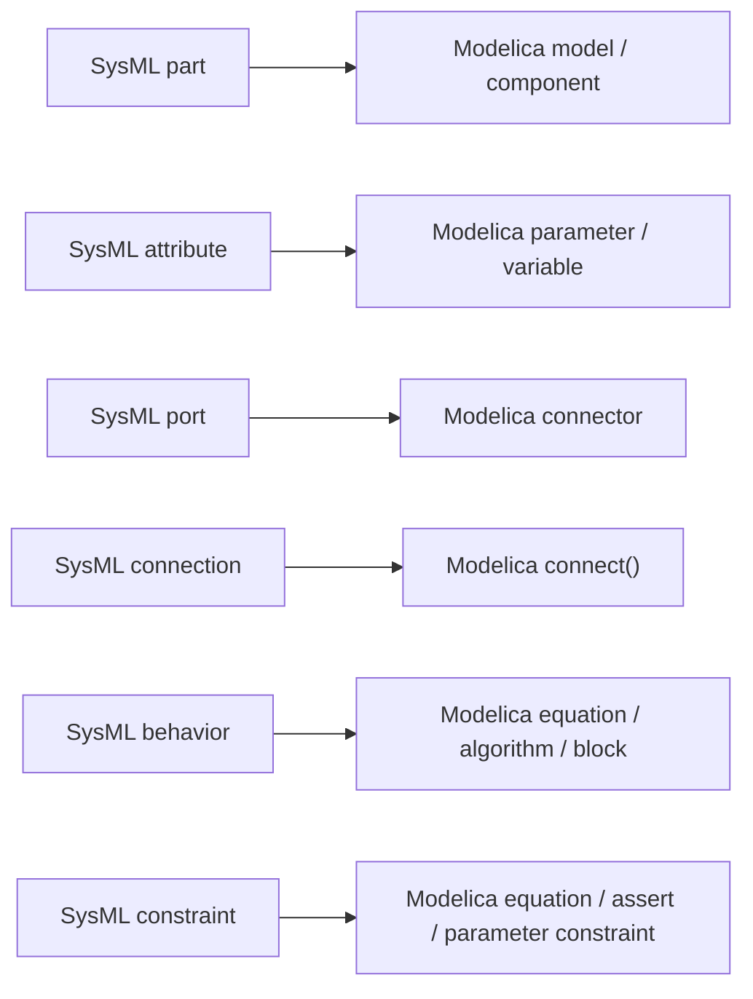

But this is not always one-to-one — that is why the mapping agent stage exists as its own step rather than a lookup table.

---

## 10. Component Mapping

Suppose SysML has `part def Controller`. The Modelica agent must determine whether it becomes `model Controller`, `block Controller`, or an existing library component. This decision depends on:

```text
physical behavior
signal behavior
causality
equations
existing implementation
library availability
```

The agent should query the Knowledge Agent if the engineering meaning isn't sufficiently clear.

---

## 11. Property Mapping

Suppose SysML says `CO2Limit = 1000 ppm`. Modelica could have:

```modelica
parameter Real CO2Limit(unit = "ppm") = 1000;
```

The agent must preserve value, unit, meaning, source, and requirement — using proper Modelica units/types rather than silently treating everything as dimensionless.

---

## 12. Interface Mapping

One of the most important parts.

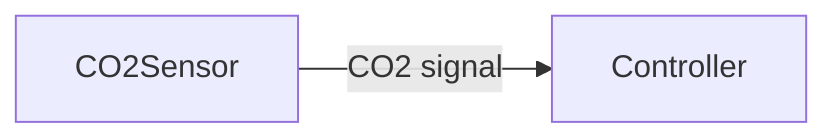

Could become conceptually:

```modelica
Modelica.Blocks.Interfaces.RealOutput CO2;   // on CO2Sensor
Modelica.Blocks.Interfaces.RealInput  CO2;   // on Controller

connect(sensor.CO2, controller.CO2);
```

But the actual connector selection must depend on the engineering domain — for physical systems it could instead involve a fluid, thermal, electrical, mechanical, or signal connector.

---

## 13. Library Resolver

Its own component. The Modelica Agent needs to determine whether a component can be implemented with an existing Modelica library component.

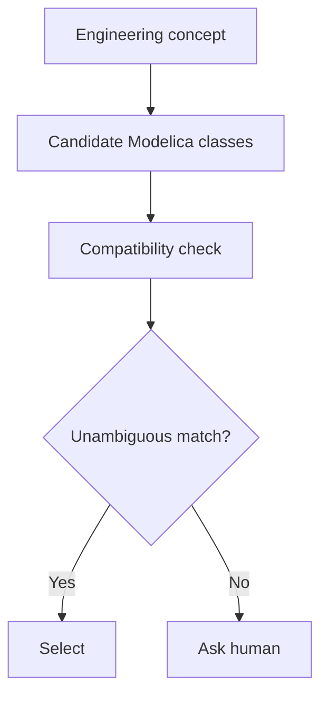

It should consider: domain, connector compatibility, parameters, units, library version, dependencies, existing project conventions. Don't let the LLM invent library class names blindly.

---

## 14. Legacy Modelica Reuse

Particularly important for these datasets. Suppose `legacy_co2_control.mo` already contains a CO2 controller, damper control, and control equations.

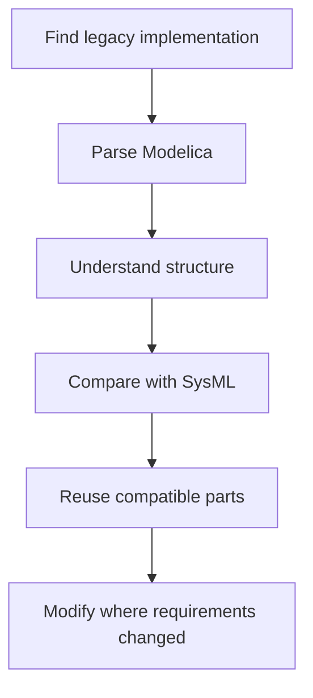

Rather than: throw away the legacy model and generate a new one from scratch.

---

## 15. Legacy Comparison

Create `modelica/analysis/legacy_comparison.json`:

```json
{
  "sysml_element": "CO2Controller",
  "legacy_class": "LegacyCO2Controller",
  "matches": ["CO2 input", "ventilation output"],
  "differences": ["SysML requires 900 ppm", "legacy model uses 1000 ppm"],
  "recommendation": "MODIFY_LEGACY"
}
```

This makes the transformation explainable.

---

## 16. Behavior Mapping

Harder than structural mapping. Suppose `CO2 > 1000 ppm → increase ventilation`. The Modelica Agent must determine whether this becomes an `equation`, an `algorithm`, a control block, or a state machine. The correct representation depends on the behavior — the LLM can plan this, but Modelica validation must verify the resulting implementation.

---

## 17. Requirement Preservation

Requirements should not disappear during transformation.

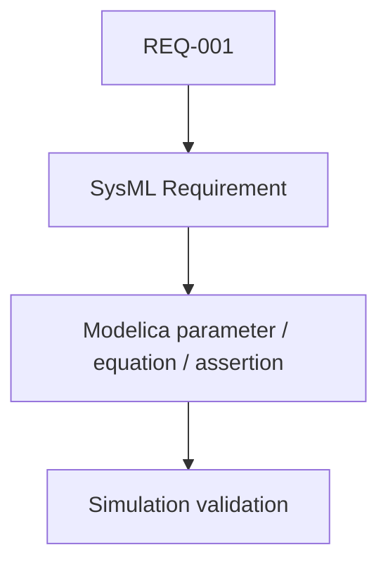

Example: `REQ-001: CO2 ≤ 1000 ppm` could result in `assert(CO2 <= CO2Limit, ...)` if appropriate to the model. Not every requirement should automatically become an assertion — some are design requirements verified externally (see the deterministic requirement verifier in `Compiler Agent.md`, Section 13).

---

## 18. Constraint Mapping

Separate: design constraint, physical equation, simulation assertion, parameter bound. Don't automatically turn every SysML constraint into a Modelica equation — the agent needs an explicit mapping decision, recorded the same way as component and property mappings.

---

## 19. Modelica Generation

Only now generate `modelica/generated/`:

```text
modelica/
├── generated/
│   ├── IAQSystem.mo
│   ├── AHU.mo
│   ├── CO2Sensor.mo
│   ├── Controller.mo
│   └── Damper.mo
│
├── package.mo
└── package.order
```

For larger systems, use nested packages.

---

## 20. Modelica Manifest

Create `modelica/generated/modelica_manifest.json`:

```json
{
  "modelica_version": "v0001",
  "sysml_version": "v0004",
  "knowledge_version": "v0008",
  "classes": ["IAQSystem", "AHU", "CO2Sensor", "Controller"]
}
```

---

## 21. Traceability

Create `modelica/traceability/modelica_traceability.json`:

```json
{
  "ENT-001": {
    "sysml_element": "AHU",
    "modelica_class": "AHU",
    "file": "AHU.mo"
  },
  "REQ-001": {
    "sysml_requirement": "CO2Requirement",
    "modelica_elements": ["Controller.CO2Limit"],
    "evidence": ["EV-101"]
  }
}
```

This gives the complete chain:

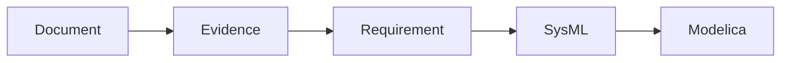

---

## 22. Modelica Validation

The generated model needs several validation layers.

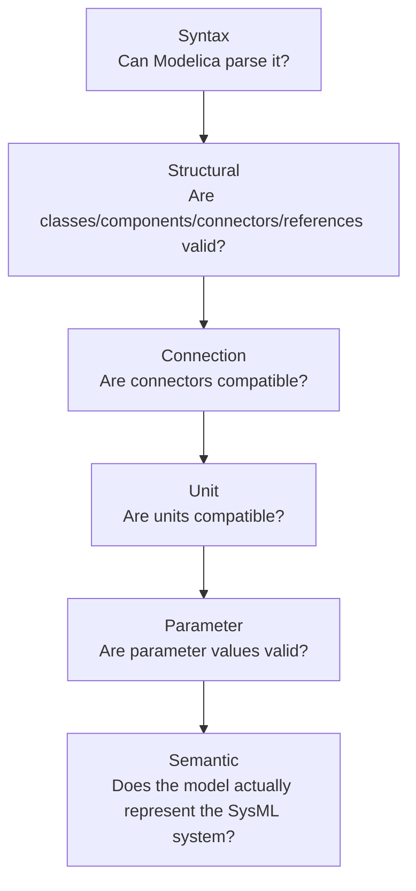

---

## 23. Compiler Agent Boundary

Don't make the Modelica Agent responsible for the entire compiler infrastructure.

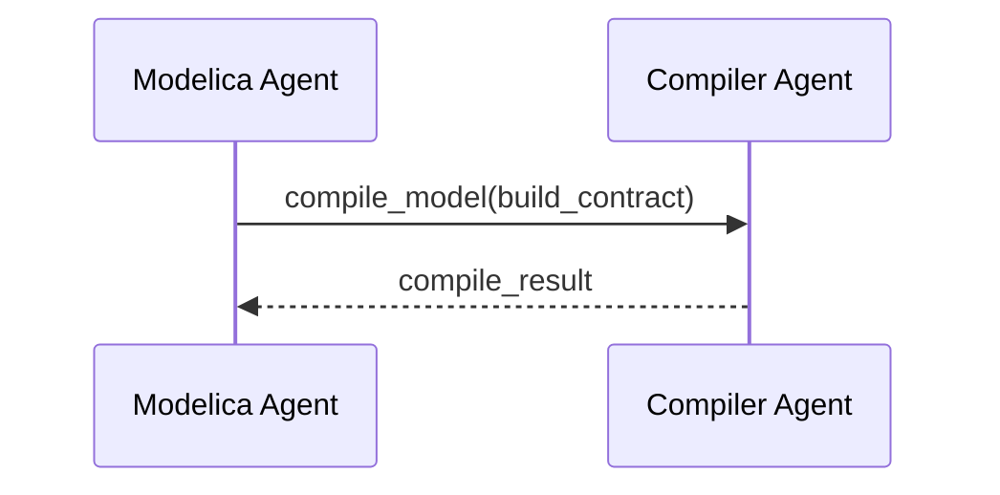

The Compiler Agent (fully specified in `Compiler Agent.md`) handles: compiler executable, library paths, execution environment, temporary/sandboxed build directory, logs, exit code. The Modelica Agent only consumes the structured result.

---

## 24. Compiler Errors

Example: `Error: Connector type mismatch.`

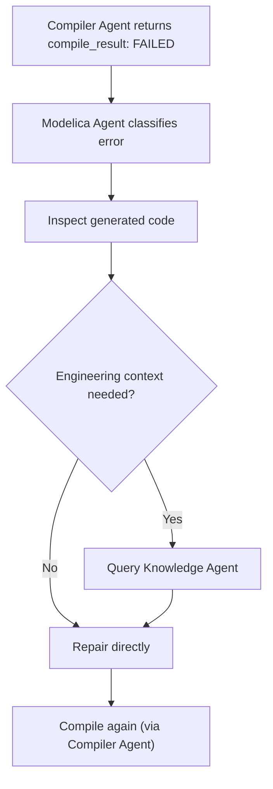

---

## 25. Diagnosis Should Be Separate

Eventually: `Compiler Agent → Diagnosis Agent`. The Diagnosis Agent can ask:

```text
Knowledge Agent:  What should this connector represent?
Modelica Agent:   What was generated?
SysML Agent:      What does the architecture say?
```

...then recommend a correction. The Modelica Agent executes that correction; it does not diagnose on its own once a Diagnosis Agent exists in the loop.

---

## 26. Human-in-the-Loop

**HITL-1 — No valid Modelica mapping**
SysML element `ThermalControlUnit` has multiple plausible mappings (A, B, C). Ask the engineer.

**HITL-2 — Library ambiguity**
Two Modelica library components appear compatible. Ask which library/component should be used if the choice has engineering consequences.

**HITL-3 — Missing parameter**
Required parameter `heatTransferCoefficient` has no source. Ask the engineer.

**HITL-4 — Legacy vs. new requirement conflict**
Legacy model uses 1000 ppm; current requirement is 900 ppm. The Knowledge Agent should resolve this if evidence allows; otherwise, HUMAN.

**HITL-5 — Semantic validation failure**
Model compiles but doesn't represent the intended system — e.g. SysML says "controller controls damper" but the generated Modelica leaves the controller output unconnected. Ask/repair.

---

## 27. Automatic Repair

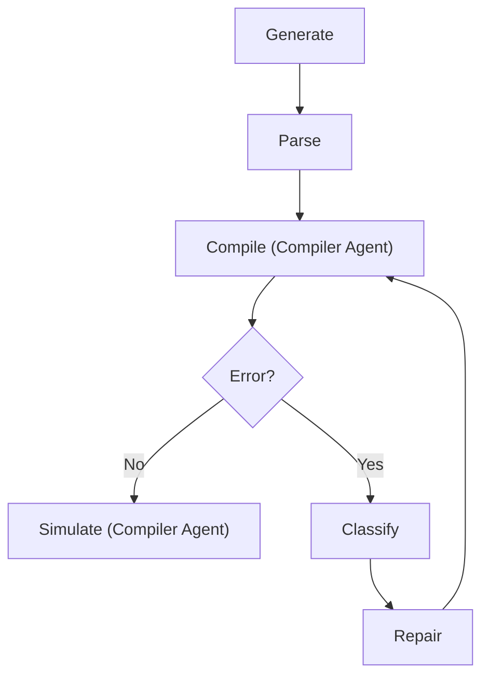

Maximum attempts: 3. Then HITL.

---

## 28. Simulation Feedback

This is where the architecture becomes much more interesting. Suppose the model compiles, but simulation shows `CO2 rises continuously`. The system must not conclude "Modelica code is valid, therefore done."

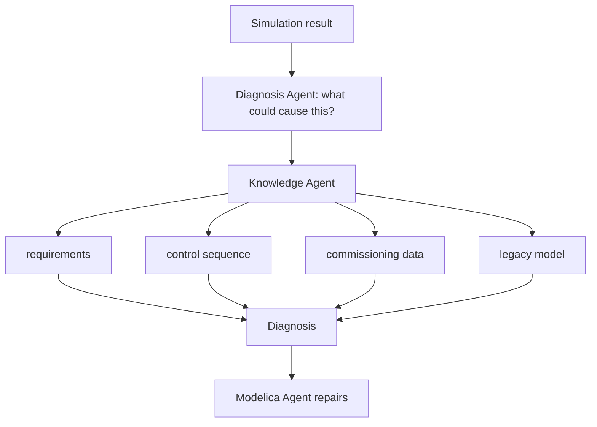

---

## 29. Modelica Agent State

```python
class ModelicaState(TypedDict):
    project_id: str

    knowledge_version: str
    sysml_version: str
    modelica_version: str

    generation_id: str
    generation_plan: dict
    mappings: list[dict]

    generated_files: list[str]

    compiler_errors: list[dict]
    validation_errors: list[dict]

    repair_attempt: int
    simulation_status: str

    pending_questions: list[dict]
    status: str
```

Do not put the entire project/document contents into LangGraph state.

---

## 30. Complete Modelica Workflow

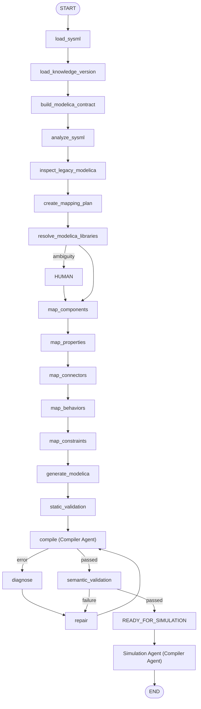

---

## 31. After Simulation — The Full Loop

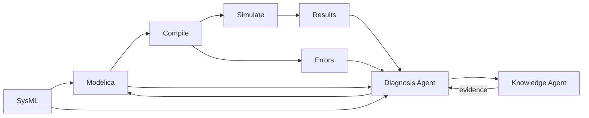

---

## 32. Project Folder After Adding This Agent

```text
projects/
└── iaq_001/
    │
    ├── source/
    ├── normalized/
    ├── observations/
    ├── index/
    ├── semantic/
    ├── evidence/
    ├── uncertainty/
    ├── decisions/
    │
    ├── sysml/
    │   ├── input/
    │   ├── plan/
    │   ├── generated/
    │   ├── traceability/
    │   ├── validation/
    │   └── versions/
    │
    ├── modelica/
    │   │
    │   ├── input/
    │   │   └── modelica_generation_contract.json
    │   ├── analysis/
    │   │   └── legacy_comparison.json
    │   ├── plan/
    │   │   └── modelica_mapping.json
    │   ├── generated/
    │   │   ├── package.mo
    │   │   ├── package.order
    │   │   ├── IAQSystem.mo
    │   │   ├── AHU.mo
    │   │   ├── CO2Sensor.mo
    │   │   └── Controller.mo
    │   ├── traceability/
    │   │   └── modelica_traceability.json
    │   ├── validation/
    │   │   ├── syntax_report.json
    │   │   ├── structure_report.json
    │   │   ├── connection_report.json
    │   │   ├── unit_report.json
    │   │   └── semantic_report.json
    │   └── versions/
    │       ├── v0001/
    │       └── v0002/
    │
    └── compiler/            # owned by the Compiler / Simulation Agent
        └── (see Compiler Agent.md, Section 5)
```

---

## 33. The Key Relationship Between the Agents

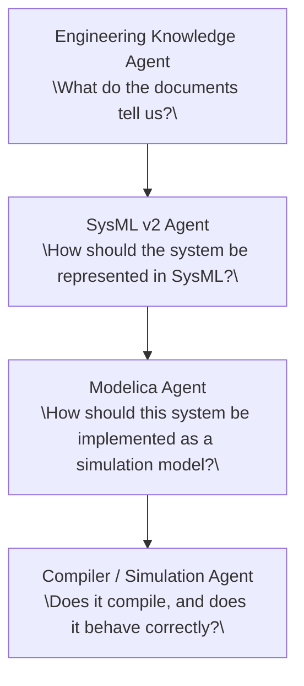

The arrows aren't one-way. The Modelica Agent can go back to the Knowledge Agent ("I need information about this component"), and the SysML Agent can do the same.

---

## 34. One More Important Design Principle

Don't force the Modelica Agent to generate everything from SysML alone.

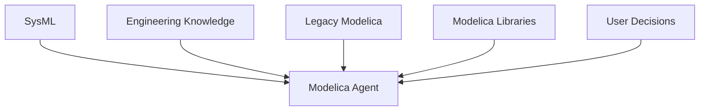

SysML describes the system architecture and intent; it does not necessarily contain everything required to create a numerically meaningful Modelica simulation. For example, SysML might say "heat exchanger," but the Modelica implementation may need heat transfer coefficient, mass flow, fluid properties, geometry, initial conditions, pressure drop. Those come from the Engineering Knowledge Agent, datasheets, engineering registers, existing Modelica, or user clarification — which is why keeping the Knowledge Agent available throughout the entire lifecycle matters.

---

## 35. Recommended Build Order

Before coding this agent, the four contracts below must exist. All four are already fully defined in [`Agent Contracts.md`](./Agent%20Contracts.md) — import them from `shared/contracts/`, do not redeclare them here:

```text
1. Modelica Generation Contract   (Agent Contracts.md, Section 8)
2. Modelica Mapping Record        (Agent Contracts.md, Section 9)
3. Modelica Validation Result     (Agent Contracts.md, Section 11)
   + Compile/Simulation/Verification Result (Agent Contracts.md, Sections 15, 17, 18)
4. Modelica Traceability Record   (Agent Contracts.md, Section 12)
```

Then build the rest in this order:

```text
5. sysml_analyzer.py
6. modelica_generation_contract builder (consumes shared/contracts/modelica_generation.py)
7. element_mapper.py / property_mapper.py / relationship_mapper.py
8. connector_mapper.py
9. library_resolver.py / library_catalog.py / compatibility.py
10. modelica_analyzer.py (legacy parsing) + legacy_comparison builder
11. behavior_mapper.py / requirement_mapper.py / constraint_mapper.py
12. modelica_generator.py (+ package/model/connector/equation/parameter
    generators)
13. syntax_validator.py / structure_validator.py / connection_validator.py
14. unit_validator.py / parameter_validator.py / semantic_validator.py
15. compiler_agent_client.py (integration with Compiler Agent.md)
16. error_classifier.py / repair_planner.py / modelica_repair.py
17. modelica_traceability.py
18. LangGraph workflow wiring (modelica_graph.py)
19. integration tests against the four golden datasets, exercising legacy
    reuse, a forced compile failure and repair, and a requirement
    violation caught only by simulation
```

Once those four schemas are solid, the actual Modelica Agent implementation becomes much cleaner.
