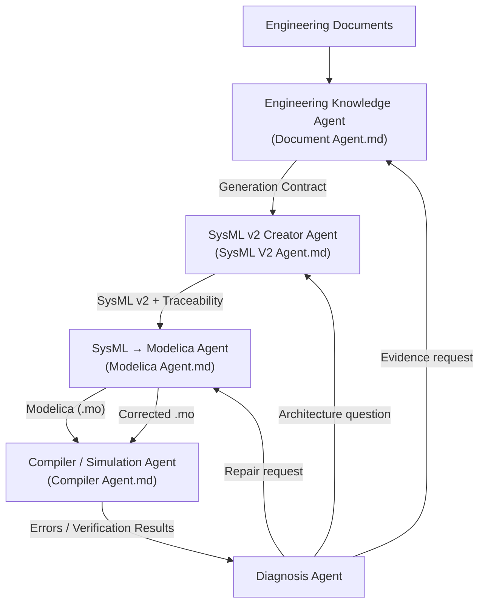
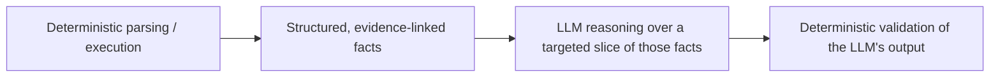
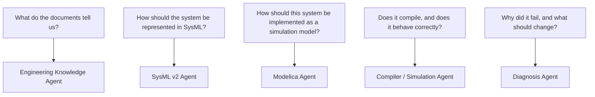
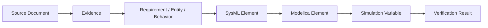

# Engineering AI Pipeline — Architecture Overview

This project is a four-agent pipeline that turns raw engineering documents into a validated, simulated engineering model — with every generated fact traceable back to the source evidence that justified it.



## Documents in this repository

| Document | Owns |
|---|---|
| [`Document Agent.md`](./Document%20Agent.md) | Ingesting engineering documents into evidence-backed, versioned knowledge |
| [`SysML V2 Agent.md`](./SysML%20V2%20Agent.md) | Transforming knowledge into a valid, traceable SysML v2 model |
| [`Modelica Agent.md`](./Modelica%20Agent.md) | Transforming SysML + knowledge + legacy Modelica into `.mo` |
| [`Compiler Agent.md`](./Compiler%20Agent.md) | Compiling, simulating, and deterministically verifying requirements |
| [`Agent Contracts.md`](./Agent%20Contracts.md) | The full, typed schema for every payload that crosses an agent boundary |

Each document is self-contained and can be implemented independently once its input contract is defined, but they are designed as one system — read them in the order above the first time through.

---

## The Core Idea

> The LLM reasons over engineering evidence; it never becomes the engineering database, the compiler, or the simulator.

Every stage in the pipeline follows the same discipline:



This shows up four times, once per agent:

```text
Document Agent    : deterministic file parsers  → LLM semantic extraction  → provenance/coverage validation
SysML Agent       : LLM model planning/mapping   → SysML generation         → parser/compiler validation
Modelica Agent    : LLM mapping/behavior planning → Modelica generation      → parser/compiler validation
Compiler Agent    : no LLM at all — compiler exit code and solver output ARE the truth
```

The Compiler / Simulation Agent is deliberately the least "AI" of the four: its entire job is to be the deterministic ground truth that the other three get checked against.

---

## Why Four Agents and Not One

Each agent owns a different *kind* of question, and mixing them produces exactly the failure this design avoids — an LLM asked to both invent and grade its own work.



`Diagnosis Agent` is referenced throughout the four documents as the coordinator of the repair loop (it queries the Knowledge Agent for evidence and asks the Modelica/SysML Agents to repair), but is intentionally out of scope for a dedicated spec here — it is a thin orchestrator over the tools the other four already expose, not a new subsystem.

---

## Shared Design Rules (apply to all four agents)

1. **Evidence over assertion.** Every generated fact — a requirement, a SysML element, a Modelica parameter, a verification result — carries a chain back to the document, page, cell, or line that justified it.
2. **Deterministic first, LLM second.** Parsing, validation, compilation, and simulation are never delegated to an LLM. The LLM plans, maps, and generates; code and external tools check the result.
3. **Small, structured LLM inputs.** No agent ever sends "the whole project" to one prompt. Every LLM call receives a targeted, schema-shaped slice of the knowledge relevant to the question at hand.
4. **Immutable history.** Observations, semantic model versions, SysML versions, Modelica versions, and compiler/simulation executions are all append-only and versioned. Nothing is silently overwritten.
5. **Bounded, classified retries.** Every repair loop has a small maximum retry count and escalates to a human when exhausted. Infrastructure failures (timeouts, crashes) and engineering failures (a wrong equation, a violated requirement) are never retried through the same mechanism.
6. **Isolation for untrusted execution.** Only the Compiler / Simulation Agent ever executes generated code, and only inside a resource-limited, network-disabled, ephemeral container.
7. **Human-in-the-loop only for high-impact decisions.** Naming, formatting, and low-impact inferred details are handled automatically; architecture-changing ambiguity, safety-critical missing values, and conflicting requirements go to a human.
8. **No phased rollout — one system.** Each agent's document describes its complete, unified implementation scope. Build order (which files/components get coded first) is dependency-driven, not milestone-gated; there is no partial "MVP" that deliberately omits capability.

---

## Full Traceability Chain

The single most valuable property of this architecture is that any generated artifact can answer "why do you exist?" all the way back to its source:



Concretely: `owner_iaq_requirements.pdf, page 8` → `EV-101` → `REQ-001 (CO2 ≤ 1000 ppm)` → `CO2Requirement` (SysML) → `Controller.CO2Limit` (Modelica) → `controller.CO2` (simulation variable) → `VIOLATED, observed max 1123.7 ppm`.

---

## Golden Datasets

All four agents are validated against the same four integration projects, each exercised end-to-end (documents → knowledge → SysML → Modelica → compile → simulate → verify):

```text
IAQ (Indoor Air Quality control)
Magnetic Circuit
NaCl Evaporation
Tank
```

See `Document Agent.md`, Section 64 for expected coverage per dataset, and `Compiler Agent.md`, Section 24 for the compile/simulate/verify test matrix run against each one.

---

## Where to Start Implementing

Follow each document's own "Recommended Build Order" section, in this overall sequence:

```text
0. Agent Contracts.md     — implement shared/contracts/ first; every step below imports from it
1. Document Agent.md      — Section 70 (Recommended Build Order)
2. SysML V2 Agent.md      — Section 31 (Recommended Build Order)
3. Modelica Agent.md      — Section 35 (Recommended Build Order)
4. Compiler Agent.md      — Section 25 (Recommended Build Order)
```

Nothing in step 2 is meaningful without step 1's retrieval API; nothing in step 3 is meaningful without step 2's traceability file; nothing in step 4 is meaningful without step 3's build contract. Every one of those handoffs is a Pydantic model defined once in `Agent Contracts.md` — build that shared package before any agent-specific code, so no agent ever invents its own shape for a value another agent already produces. Build in this order, but design and document all five as the single system they are.
