# SysML v2 Creator Agent — Detailed Implementation Plan

> Part of a four-agent pipeline. See also: [`Document Agent.md`](./Document%20Agent.md) (Engineering Knowledge Agent), [`Modelica Agent.md`](./Modelica%20Agent.md) (SysML → Modelica Agent), [`Compiler Agent.md`](./Compiler%20Agent.md) (Compiler / Simulation Agent), [`Agent Contracts.md`](./Agent%20Contracts.md) (the typed schema for every payload exchanged between these agents), and the top-level [`README.md`](./README.md) for the unified architecture.

SysML v2 Creator Agent is the next agent after the Engineering Knowledge Agent.

The most important design decision: the SysML Agent should **not** read the original PDFs/DOCX/XLSX/etc. directly. It should consume the structured, evidence-backed knowledge exposed by the Document Agent.

## 1. Overall Role

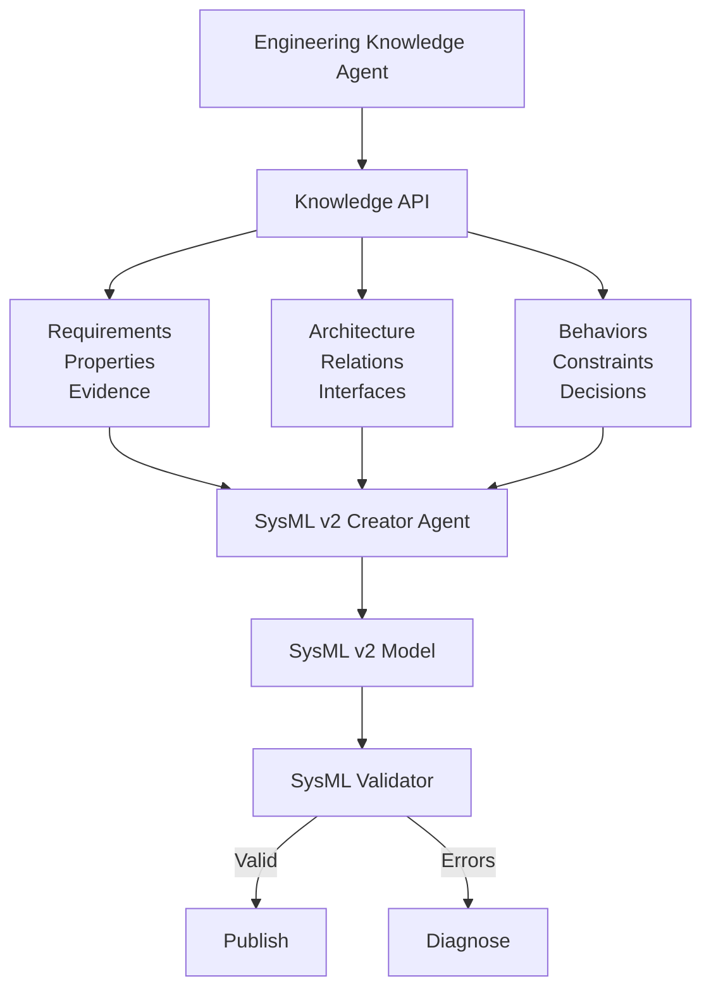

Its responsibility: transform the engineering knowledge model into a valid, traceable SysML v2 model. It should not invent engineering requirements.

---

## 2. What Exactly Does It Receive?

The SysML Agent receives a structured **SysML Generation Contract** from the Engineering Knowledge Agent.

```json
{
  "project_id": "iaq_001",
  "knowledge_version": "v0008",

  "requirements": [
    {
      "id": "REQ-001",
      "subject": "Zone-01",
      "property": "CO2",
      "max": 1000,
      "unit": "ppm",
      "status": "CONFIRMED",
      "evidence": ["EV-101"]
    }
  ],

  "entities": [
    { "id": "ENT-001", "name": "AHU-01", "type": "AirHandlingUnit" },
    { "id": "ENT-002", "name": "CO2Sensor-01", "type": "CO2Sensor" }
  ],

  "relationships": [
    { "source": "ENT-001", "target": "ENT-002", "type": "CONNECTED_TO" }
  ],

  "behaviors": [],
  "constraints": [],
  "interfaces": []
}
```

This contract becomes the input boundary for the SysML Agent.

---

## 3. Don't Make the SysML Agent One Giant LLM Prompt

Avoid:

```text
"Here are 500 pages of engineering information. Generate SysML v2."
```

Instead use a pipeline:

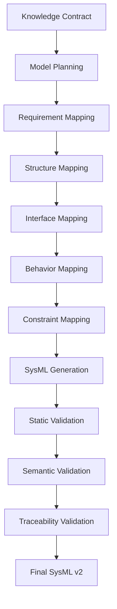

This makes debugging much easier — a failure is attributable to one stage, not to "the LLM got it wrong somewhere."

---

## 4. SysML Agent Internal Architecture

```text
sysml_agent/
│
├── agent.py
│
├── planning/
│   ├── model_planner.py
│   └── generation_plan.py
│
├── mapping/
│   ├── requirement_mapper.py
│   ├── entity_mapper.py
│   ├── relationship_mapper.py
│   ├── behavior_mapper.py
│   ├── constraint_mapper.py
│   └── interface_mapper.py
│
├── generation/
│   ├── package_generator.py
│   ├── part_generator.py
│   ├── requirement_generator.py
│   ├── interface_generator.py
│   ├── behavior_generator.py
│   ├── constraint_generator.py
│   └── sysml_generator.py
│
├── validation/
│   ├── syntax_validator.py
│   ├── structure_validator.py
│   ├── requirement_validator.py
│   ├── traceability_validator.py
│   └── semantic_validator.py
│
├── repair/
│   ├── error_classifier.py
│   └── sysml_repair.py
│
├── traceability/
│   └── traceability_manager.py
│
└── schemas/
    ├── generation_contract.py
    ├── generation_plan.py
    ├── validation_result.py
    └── sysml_model.py
```

---

## 5. Step 1 — Create the Generation Contract

This is extremely important. Don't let the SysML Agent call fifteen different Document Agent APIs randomly every time it needs something — create a well-defined contract instead.

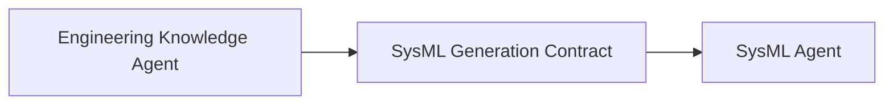

The contract contains:

```text
Requirements   REQ-001, REQ-002, REQ-003
Entities       System, Subsystem, Component, Sensor, Controller, Actuator
Relationships  contains, connected_to, controls, supplies, serves
Properties     temperature, pressure, CO2, flow rate
Behaviors      if CO2 > 1000 ppm → increase ventilation
Constraints    20 °C <= temperature <= 24 °C
Interfaces     sensor signal, air flow, electrical connection, control signal
Evidence       (attached to every item above)
```

Every item retains evidence IDs.

---

## 6. Step 2 — Model Planner

The first LLM stage should **not** generate SysML code. It creates a plan.

```json
{
  "packages": ["IAQSystem", "Requirements", "Architecture", "Behaviors", "Interfaces"],
  "parts": ["IAQSystem", "AHU", "CO2Sensor", "Controller", "Damper"],
  "requirements": ["REQ-001", "REQ-002"],
  "interfaces": ["CO2Signal", "ControlSignal"],
  "behaviors": ["CO2Control"]
}
```

Why? Because planning and code generation are different problems — mixing them makes both harder to validate.

---

## 7. Step 3 — Map Engineering Entities to SysML Concepts

The agent needs a mapping layer.

| Engineering concept | SysML v2 representation |
|---|---|
| System | `part def` |
| Physical component | `part def` |
| Instance | `part` |
| Requirement | `requirement def` |
| Requirement instance | `requirement` |
| Interface | `interface def` |
| Port | `port def` / `ports` |
| Flow | `flow` / connection constructs |
| Behavior | `action def`, `state def`, etc. |
| Constraint | `constraint def` |
| Value / property | `attribute` |
| Connection | connection / related SysML relationship |

The exact mapping is determined by model semantics, not blindly by keyword matching.

---

## 8. Worked Example

Suppose the Knowledge Agent provides:

```text
System:          IAQSystem
Components:      AHU-01, CO2Sensor-01, Controller-01, Damper-01
Relationships:   CO2Sensor-01 → Controller-01, Controller-01 → Damper-01
Behavior:        CO2 > 1000 ppm → increase ventilation
```

The SysML planner may decide:

```sysml
package IAQSystem {
    part def AHU;
    part def CO2Sensor;
    part def Controller;
    part def Damper;

    requirement def CO2Requirement;

    action def IncreaseVentilation;

    part iaqSystem : IAQSystem {
        part ahu : AHU;
        part sensor : CO2Sensor;
        part controller : Controller;
        part damper : Damper;
    }
}
```

The LLM makes the semantic mapping decision, but the resulting structure is validated deterministically afterward.

---

## 9. Step 4 — Requirement Mapping

One of the most important pieces.

Input:

```json
{
  "requirement_id": "REQ-001",
  "subject": "Zone-01",
  "property": "CO2",
  "operator": "<=",
  "value": 1000,
  "unit": "ppm"
}
```

The agent creates a SysML requirement representation while critically preserving the trace:

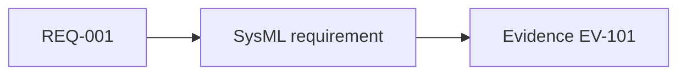

So later, "why does this SysML requirement exist?" always has an answer:

```text
Requirement REQ-001
Source: owner_iaq_requirements.pdf, page 8
```

---

## 10. Step 5 — Architecture Generation

The architecture generator handles: system, subsystem, component, part, composition, relationships.

Example conceptual structure:

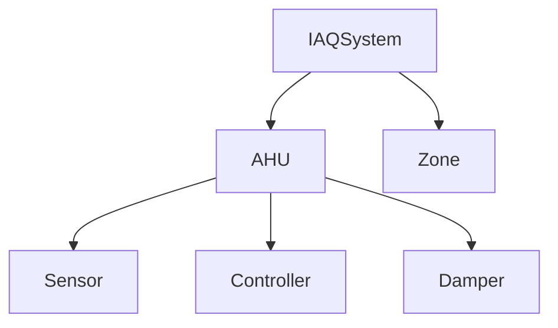

The hierarchy must come from the Knowledge Agent. The SysML Agent should not decide on its own that "AHU contains sensor" unless the engineering knowledge supports it or the user explicitly approves the interpretation.

---

## 11. Step 6 — Interface Generation

This deserves its own stage.

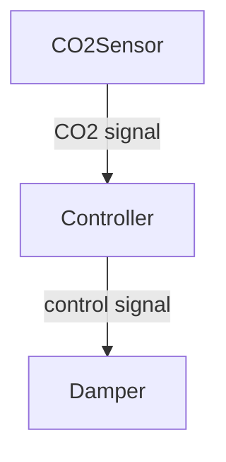

The SysML Agent identifies interface, port, flow, and connection from the engineering relationships. This is also where the future Modelica Agent gets valuable information — see [`Modelica Agent.md`](./Modelica%20Agent.md), Section 12 (Interface Mapping).

---

## 12. Step 7 — Behavior Generation

Behavior should not be treated as plain text.

Knowledge: `IF CO2 > 1000 ppm THEN increase ventilation`

becomes a structured SysML behavior:

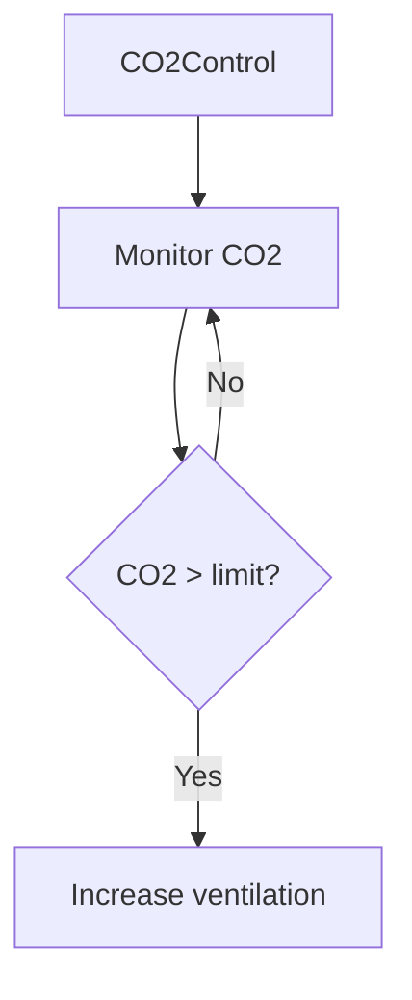

Depending on the behavior, the agent selects the appropriate SysML behavioral construct (`action def`, `state def`, etc.).

---

## 13. Step 8 — Constraint Generation

For `20 °C ≤ ZoneTemperature ≤ 24 °C`, the agent creates a constraint representation that preserves: value, unit, operator, property, requirement, evidence. Don't reduce it to a comment.

---

## 14. Step 9 — Generate SysML v2

Only after the model plan and mappings are ready should the code generator run. Generate multiple logical artifacts rather than one enormous file:

```text
generated/
│
├── IAQSystem.sysml
├── Requirements.sysml
├── Architecture.sysml
├── Interfaces.sysml
├── Behaviors.sysml
└── Constraints.sysml
```

For larger projects, use a package-per-directory layout:

```text
package/
    ├── requirements/
    ├── architecture/
    ├── interfaces/
    ├── behaviors/
    └── constraints/
```

For a small project, a single generated file is acceptable.

---

## 15. Generated Model Manifest

Alongside SysML, create `sysml_manifest.json`:

```json
{
  "model_version": "v001",
  "files": ["Architecture.sysml", "Requirements.sysml", "Behaviors.sysml"],
  "requirements": {
    "REQ-001": { "sysml_element": "CO2Requirement", "evidence": ["EV-101"] }
  },
  "entities": {
    "ENT-001": { "sysml_element": "AHU" }
  }
}
```

This becomes the bridge between Engineering Knowledge and SysML.

---

## 16. Traceability Is Mandatory

Make traceability a first-class feature: `traceability/sysml_traceability.json`

```json
{
  "REQ-001": {
    "source_evidence": ["EV-101"],
    "sysml_element": "CO2Requirement",
    "file": "Requirements.sysml"
  },
  "ENT-001": { "sysml_element": "AHU" },
  "BEH-001": { "sysml_element": "CO2Control" }
}
```

This becomes extremely valuable during Modelica generation and debugging.

---

## 17. Step 10 — SysML Validation

Never trust generated SysML just because the LLM produced syntactically plausible text. Validation has several layers.

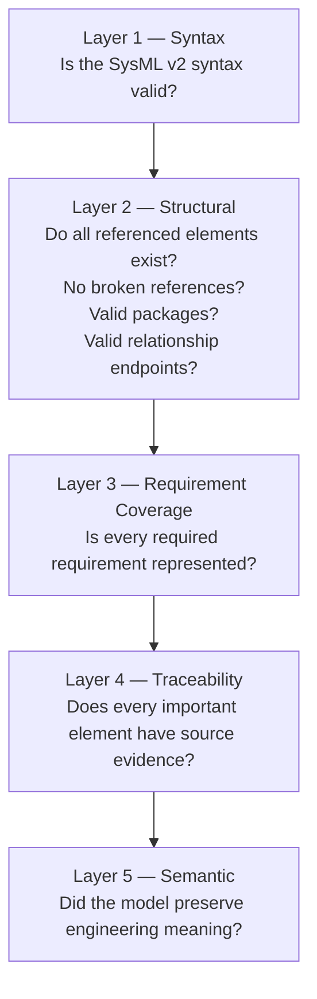

---

## 18. Validation Result

Create `validation/sysml_validation_report.json`:

```json
{
  "status": "FAILED",
  "syntax_errors": [],
  "structural_errors": [
    { "element": "Controller", "error": "Referenced port does not exist" }
  ],
  "traceability_errors": [],
  "requirement_coverage": { "total": 12, "implemented": 11, "missing": 1 }
}
```

---

## 19. Automatic Repair Loop

The SysML Agent has its own repair loop.

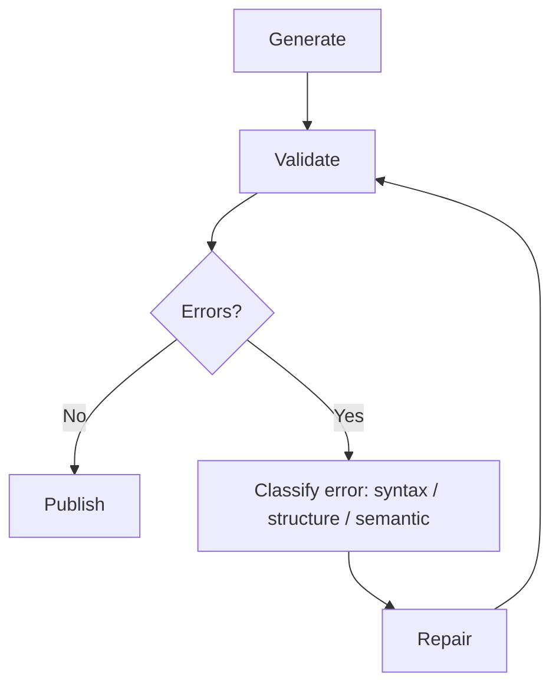

Limit retries: `max_attempts = 3`. After that: `HUMAN_REVIEW_REQUIRED`.

---

## 20. Human-in-the-Loop for the SysML Agent

There should be fewer HITL points than in the Document Agent.

**HITL-1 — Architectural ambiguity**
Example: should `Controller` be part of `AHU` or a separate subsystem?

**HITL-2 — Multiple valid SysML interpretations**
Example: relationship `"serves"` could map to two different architectural structures.

**HITL-3 — Missing information**
Example: a port direction is required, but the engineering source doesn't specify it.

**HITL-4 — Semantic validation failure**
Example: the generated model is syntactically valid, but the validator finds that a requirement is not represented correctly.

**HITL-5 — Repair limit reached**
Three automatic repair attempts failed.

### What should NOT trigger HITL

```text
variable naming
package naming
formatting
file splitting
whitespace
minor syntactic repairs
```

...unless those decisions have engineering consequences. The agent handles these automatically.

---

## 21. Important Distinction: SysML Syntax vs Engineering Meaning

The LLM is very good at proposing *how* an engineering concept should map to SysML. But deterministic validation must verify that the generated SysML actually conforms.

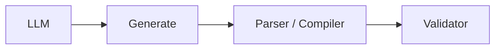

Never the shortcut: `LLM → trust generated code`.

---

## 22. SysML Agent Tools

```text
get_project_context()
get_requirements()
get_entities()
get_relationships()
get_behaviors()
get_constraints()
get_interfaces()
get_evidence()
get_decisions()
get_existing_sysml()
validate_sysml()
get_sysml_error_details()
write_sysml_file()
read_sysml_file()
search_knowledge()
```

`search_knowledge()` matters because the generation contract will sometimes not contain enough detail. The agent can go back to the Engineering Knowledge Agent:

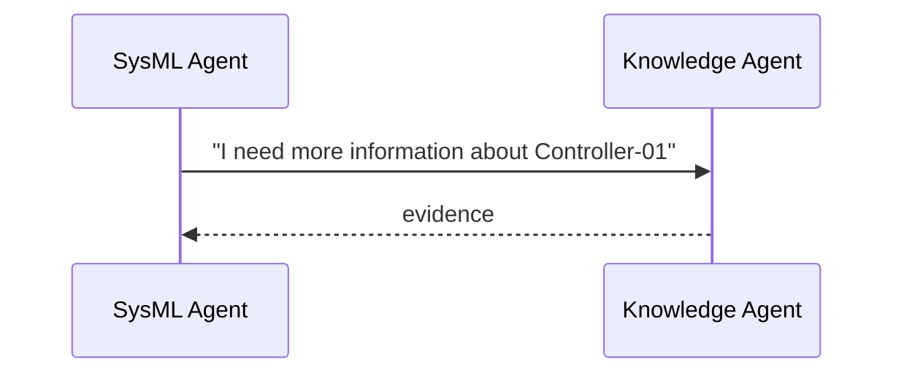

---

## 23. Don't Make the Knowledge Agent a Passive Database

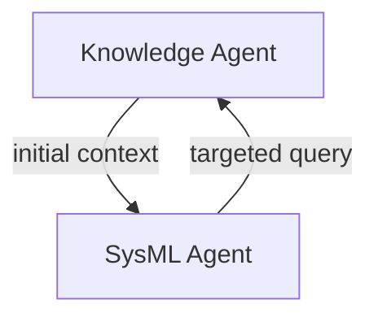

The SysML Agent performs targeted investigations. Example: "I know there is a controller, but I need to know what it controls" → `search_relationships(controller)` rather than retrieving everything.

---

## 24. SysML Agent State

```python
class SysMLState(TypedDict):
    project_id: str
    knowledge_version: str

    generation_id: str
    generation_plan: dict

    requirements_to_generate: list[str]
    entities_to_generate: list[str]
    relationships_to_generate: list[str]
    behaviors_to_generate: list[str]
    constraints_to_generate: list[str]

    generated_files: list[str]
    validation_errors: list[dict]
    repair_attempt: int

    pending_questions: list[dict]
    model_version: str
    status: str
```

Do not put entire source documents in this state.

---

## 25. SysML Project Folder

```text
projects/
└── iaq_001/
    │
    ├── source/
    ├── normalized/
    ├── observations/
    ├── index/
    ├── semantic/
    ├── evidence/
    ├── uncertainty/
    ├── decisions/
    │
    ├── sysml/
    │   ├── input/
    │   │   └── generation_contract.json
    │   ├── plan/
    │   │   └── generation_plan.json
    │   ├── generated/
    │   │   ├── IAQSystem.sysml
    │   │   ├── Requirements.sysml
    │   │   ├── Architecture.sysml
    │   │   ├── Interfaces.sysml
    │   │   └── Behaviors.sysml
    │   ├── traceability/
    │   │   └── sysml_traceability.json
    │   ├── validation/
    │   │   ├── syntax_report.json
    │   │   ├── semantic_report.json
    │   │   └── coverage_report.json
    │   └── versions/
    │       ├── v0001/
    │       └── v0002/
    │
    └── reports/
```

---

## 26. SysML Agent Workflow

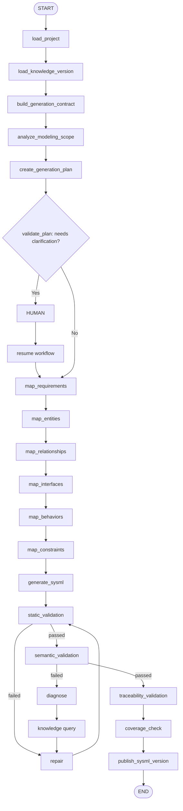

---

## 27. How the LLM Should Actually Be Used

Divide LLM responsibility into five distinct areas — never use the same prompt for all five.

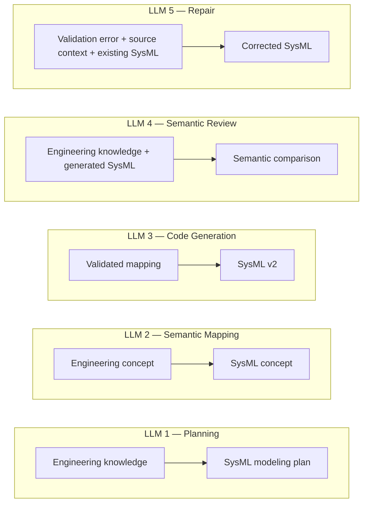

---

## 28. Deterministic Components

Use code rather than LLM wherever possible.

| Concern | Implementation |
|---|---|
| File handling | Python |
| Schema validation | Pydantic |
| SysML parsing | SysML parser/compiler |
| Reference checking | deterministic code |
| Coverage checking | deterministic code |
| Traceability | deterministic code |
| Versioning | deterministic code |
| Storage | SQLite/filesystem |
| Workflow | LangGraph |
| Planning | LLM |
| Semantic mapping | LLM |
| Generation | LLM |
| Reasoning | LLM |

This division is very important — everything that can be checked mechanically must be, so the LLM's role stays confined to genuine judgment calls.

---

## 29. Model Versioning

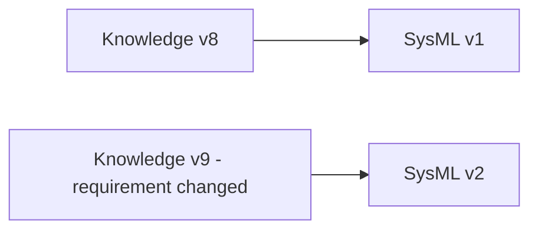

Don't overwrite `v1`. Store both under `sysml/versions/v0001/` and `sysml/versions/v0002/`, and maintain:

```json
{
  "sysml_version": "v0002",
  "knowledge_version": "v0009",
  "previous_sysml_version": "v0001"
}
```

Now you have a full chain: `Requirement change → Knowledge version → SysML version`, extremely valuable later when generating Modelica.

---

## 30. The Bridge to Modelica

This is where the architecture becomes powerful.

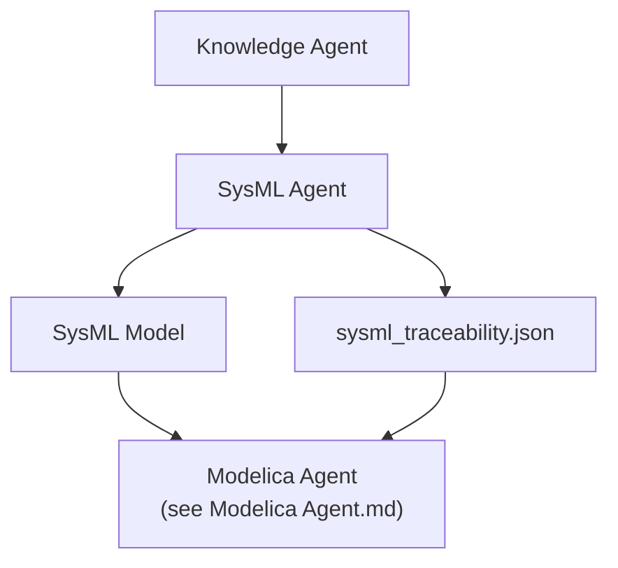

The SysML Agent produces the SysML model plus its traceability file. The Modelica Agent receives the SysML model, engineering knowledge, legacy Modelica, and evidence — it does not have to reverse-engineer everything from raw SysML text.

---

## 31. Recommended Build Order

Do not start coding the SysML Agent before defining the SysML Generation Contract. All five schemas below are already fully defined in [`Agent Contracts.md`](./Agent%20Contracts.md), Sections 2–7 — import them from `shared/contracts/`, do not redeclare them here. Implement in this order:

```text
1. shared/contracts/sysml_generation.py    (Agent Contracts.md, Section 2)
2. shared/contracts/sysml_plan.py          (Agent Contracts.md, Section 3)
3. shared/contracts/sysml_mapping.py       (Agent Contracts.md, Section 4)
4. shared/contracts/sysml_traceability.py  (Agent Contracts.md, Section 6)
5. shared/contracts/sysml_validation.py    (Agent Contracts.md, Section 5)
6. model_planner.py
7. requirement_mapper.py / entity_mapper.py / relationship_mapper.py
8. interface_mapper.py / behavior_mapper.py / constraint_mapper.py
9. sysml_generator.py (+ package/part/requirement/interface/behavior/
   constraint generators)
10. syntax_validator.py / structure_validator.py
11. requirement_validator.py / traceability_validator.py
12. semantic_validator.py
13. error_classifier.py + sysml_repair.py
14. traceability_manager.py
15. LangGraph workflow wiring (sysml_graph.py)
16. tool/API surface (Section 22)
17. integration tests against the four golden datasets
```

Otherwise the project can quickly degrade into:

```text
LLM prompt → SysML text → another LLM → more SysML text
```

which is difficult to validate and maintain. The architecture we want instead:

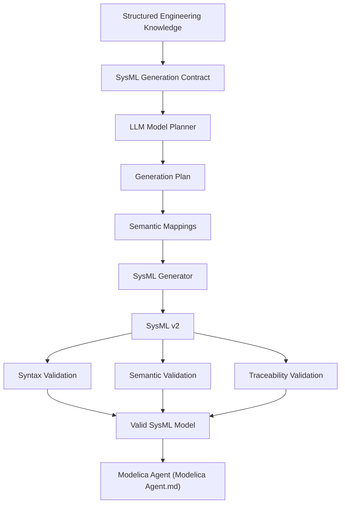

That is the SysML v2 Creator architecture.
